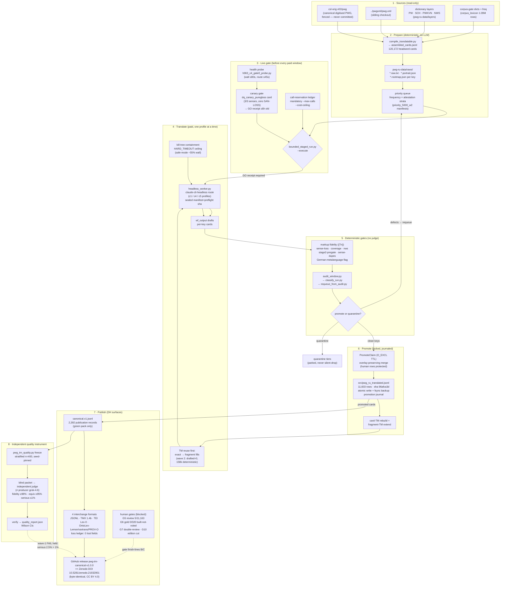

# Diagram - how PWG translation works (PWG→RU pipeline)

_Created: 22-08-2026 · Last updated: 22-08-2026_

Rendered from the audited state in
[FULL_DH_STANDARDS_AUDIT_PWG_RU_22-08-2026.md](https://github.com/gasyoun/SanskritLexicography/blob/master/RussianTranslation/FULL_DH_STANDARDS_AUDIT_PWG_RU_22-08-2026.md)
(H3291). Numbers are the 22-08 snapshot.

## Reading notes

| Edge | Meaning |
|---|---|
| Sources → assemble | Pure Python; the digitised German is never edited (csl-orig fence). |
| Live gate → bounded run | No spend without a fresh health PASS **and** a canary GO receipt consumed by code ([H2159](https://github.com/gasyoun/Uprava/blob/main/handoffs/) pin). |
| TM reuse inside translate | Fragments from already-promoted material fill new cards deterministically first; the model drafts only the residue. |
| Gates → requeue | A failed deterministic gate returns the key to the priority queue — nothing is silently dropped; defects go to named quarantine tiers. |
| Promote | The only writer of the store: lock + journal + fsynced backup; human-reviewed rows survive any re-promotion (H2146). |
| Canonical → publish | Only audit-clean "publication" records enter the citable pack; waves that failed the independent floor are withheld by name. |
| Independent QA | The R15 n=400 instrument that halted wave 1 and now guards wave 2's regeneration ([H3299](https://github.com/gasyoun/Uprava/blob/main/handoffs/H3299-Fable_SanskritLexicography_pwgtm-wave2-regenerate-regate_22.08.26.md)). |

_Dr. Mārcis Gasūns_
