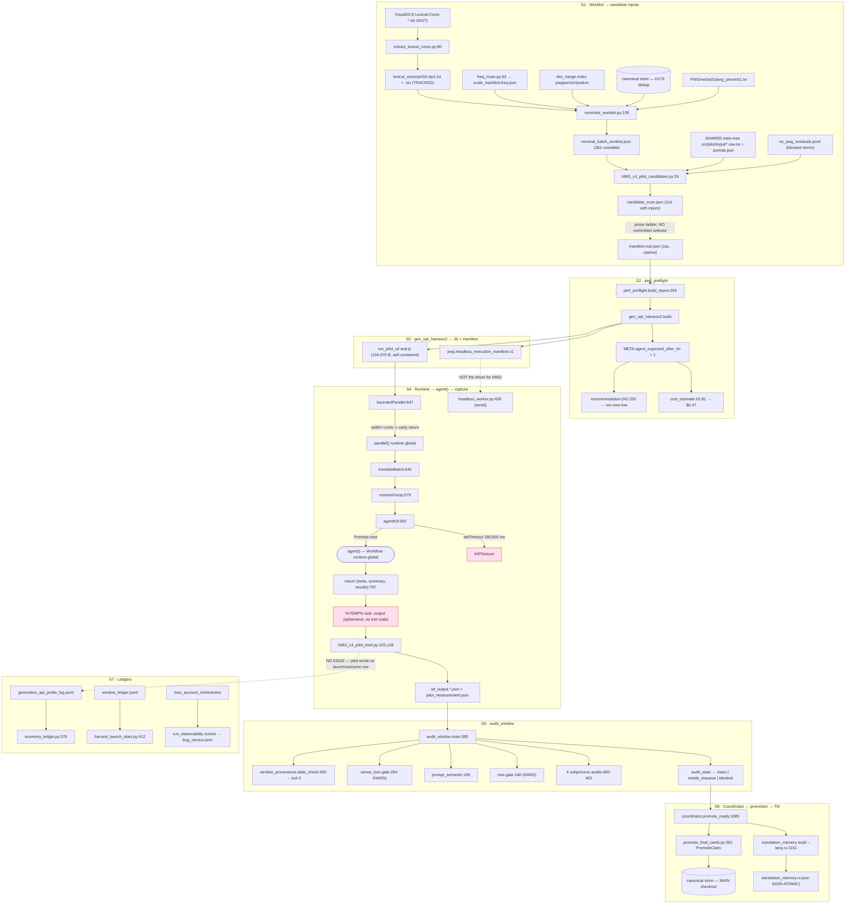

# H963 — pwg_ru pipeline call graph (verified)

_Created: 16-07-2026 · Last updated: 16-07-2026_

Model attribution: Opus 4.8 (`claude-opus-4-8[1m]`) orchestrating; per-segment census/analysis agents on the session model. Read-only measurement pass — no generation call, no harness run, no promotion, no behavior-changing patch. Every claim below carries a `path:line` anchor or an exact artifact quote; anything that could not be verified is marked **UNVERIFIED** with the reason.

Worktree root `R` = [`SanskritLexicography-h963-c4-live/RussianTranslation`](https://github.com/gasyoun/SanskritLexicography/blob/master/RussianTranslation) (branch `h963-c4-live-rung3`, clean). All `src/...` anchors are `R`-relative. Committed blob URLs point at [`gasyoun/SanskritLexicography`](https://github.com/gasyoun/SanskritLexicography/blob/master/RussianTranslation) `master`; the worktree branch is not pushed.

Companion reports read for context, not re-derived:

> [H963_C4_OWNER_OVERRIDE_PILOT_2026-07-16.md](https://github.com/gasyoun/SanskritLexicography/blob/master/RussianTranslation/pwg_ru/h963/H963_C4_OWNER_OVERRIDE_PILOT_2026-07-16.md) · [H963_C4_SINGLE_PROFILE_GATE0_HEALTH_2026-07-16.md](https://github.com/gasyoun/SanskritLexicography/blob/master/RussianTranslation/pwg_ru/h963/H963_C4_SINGLE_PROFILE_GATE0_HEALTH_2026-07-16.md)

---

## 0. Ground truth this document is consistent with

| Fact | Value |
|---|---|
| Gate-0 health (c4, 16-07-2026) | warm-up 53,290 ms · measured 104,870 ms · 0 connection errors · 6,828 B probe · ceiling 30 s ⇒ **NO-GO** |
| Owner-override pilot | 2 manifests launched CONCURRENTLY (recorded protocol deviation); canary ~118 s wall, 1/1 ok, 59,250 subagent tokens; real ~206 s wall, 0/2 ok, 2 null, 1 kill-timeout at the 180,000 ms ceiling, `skelBytes=5606` |
| Verdict | clean rate 0% vs an 80% floor ⇒ **GENERATED, NOT PROMOTED** |
| Canonical store | 11,605 rows before and after · sha256 `cc1d544ed92d201ca8cbecde0b5e9a8191994dfd1baf20841da82f1f9ae7c805` (not re-hashed this pass) |
| Selected real keys | `zaz` (3,813 B / 3 senses / 60 `<ls>`) · `upama` (4,745 B / 3 senses / 26 `<ls>`) |
| Nominal-core runnable pool | 282 lemmas · 114 with prebuilt inputs · raw median 12,556 B |

---

## 1. The graph, segment by segment

### 1.0 Overview diagram

### 1.1 Segment S1 — worklist → candidate inputs

| From | To | Anchor | Status |
|---|---|---|---|
| Leonchenko `*.xls` (VisualDCS) | `extract_lexical_cores.read_core()` | [`src/pilot/extract_lexical_cores.py:80`](https://github.com/gasyoun/SanskritLexicography/blob/master/RussianTranslation/src/pilot/extract_lexical_cores.py#L80) | VERIFIED |
| `read_core()` | `build_src.iast_to_slp1()` | [`extract_lexical_cores.py:96`](https://github.com/gasyoun/SanskritLexicography/blob/master/RussianTranslation/src/pilot/extract_lexical_cores.py#L96) | VERIFIED |
| `write_core()` | `lexical_cores/<core>.slp1.txt` + `.tsv` | [`extract_lexical_cores.py:109-117`](https://github.com/gasyoun/SanskritLexicography/blob/master/RussianTranslation/src/pilot/extract_lexical_cores.py#L109-L117) | VERIFIED |
| `nominals_worklist.build_worklist()` | `read_wordlist()` | [`src/pilot/nominals_worklist.py:108`](https://github.com/gasyoun/SanskritLexicography/blob/master/RussianTranslation/src/pilot/nominals_worklist.py#L108) | VERIFIED |
| `build_worklist()` | `scale_manifest.freq.json` (**rank enters**) | [`nominals_worklist.py:109`](https://github.com/gasyoun/SanskritLexicography/blob/master/RussianTranslation/src/pilot/nominals_worklist.py#L109) | VERIFIED |
| `freq_route.main()` | `scale_manifest.freq.json` (rank producer) | [`src/freq_route.py:63-64`](https://github.com/gasyoun/SanskritLexicography/blob/master/RussianTranslation/src/freq_route.py#L63-L64) | VERIFIED |
| `freq_route.main()` | `dcs_lemma_summary.json` + `dcs_lemma_renou.json` | [`freq_route.py:33-35`](https://github.com/gasyoun/SanskritLexicography/blob/master/RussianTranslation/src/freq_route.py#L33-L35) | VERIFIED |
| `freq_route.main()` | `pwg_mask.records()` → `csl-orig/v02/pwg/pwg.txt` | [`freq_route.py:38`](https://github.com/gasyoun/SanskritLexicography/blob/master/RussianTranslation/src/freq_route.py#L38) | VERIFIED |
| `build_worklist()` | `store_roots()` (H179 dedup, read side) | [`nominals_worklist.py:110`](https://github.com/gasyoun/SanskritLexicography/blob/master/RussianTranslation/src/pilot/nominals_worklist.py#L110) | VERIFIED |
| module import | `store_path.canonical_store()` | [`nominals_worklist.py:56`](https://github.com/gasyoun/SanskritLexicography/blob/master/RussianTranslation/src/pilot/nominals_worklist.py#L56) | VERIFIED |
| `build_worklist()` | `verb_universe()` → `PWG/verbs01/pwg_preverb1.txt` | [`nominals_worklist.py:111`](https://github.com/gasyoun/SanskritLexicography/blob/master/RussianTranslation/src/pilot/nominals_worklist.py#L111) | VERIFIED |
| `build_worklist()` | `dict_merge.index('pwg')` (hit/miss oracle) | [`nominals_worklist.py:112`](https://github.com/gasyoun/SanskritLexicography/blob/master/RussianTranslation/src/pilot/nominals_worklist.py#L112) | VERIFIED |
| `build_worklist()` | `corpus_gate.form_key()` | [`nominals_worklist.py:125`](https://github.com/gasyoun/SanskritLexicography/blob/master/RussianTranslation/src/pilot/nominals_worklist.py#L125) | VERIFIED |
| `build_worklist()` | `dict_merge.index('pw'/'sch'/'pwkvn')` (H206) | [`nominals_worklist.py:117`](https://github.com/gasyoun/SanskritLexicography/blob/master/RussianTranslation/src/pilot/nominals_worklist.py#L117) | VERIFIED |
| `build_worklist()` | promoted/remaining split (H179 apply side) | [`nominals_worklist.py:155-156`](https://github.com/gasyoun/SanskritLexicography/blob/master/RussianTranslation/src/pilot/nominals_worklist.py#L155-L156) | VERIFIED |
| `build_worklist()` | `sort_key()` (**rank applied — ordering only**) | [`nominals_worklist.py:161-163`](https://github.com/gasyoun/SanskritLexicography/blob/master/RussianTranslation/src/pilot/nominals_worklist.py#L161-L163) | VERIFIED |
| `main()` | `output/nominal_batch_worklist.json` | [`nominals_worklist.py:284-286`](https://github.com/gasyoun/SanskritLexicography/blob/master/RussianTranslation/src/pilot/nominals_worklist.py#L284-L286) | VERIFIED |
| `h963_c4_pilot_candidates.py` | worklist `runnable_detail` | [`src/pilot/h963_c4_pilot_candidates.py:26-28`](https://github.com/gasyoun/SanskritLexicography/blob/master/RussianTranslation/src/pilot/h963_c4_pilot_candidates.py#L26-L28) | VERIFIED |
| `h963_c4_pilot_candidates.py` | `no_pwg_residuals.jsonl` (blocked filter) | [`h963_c4_pilot_candidates.py:32-39`](https://github.com/gasyoun/SanskritLexicography/blob/master/RussianTranslation/src/pilot/h963_c4_pilot_candidates.py#L32-L39) | VERIFIED |
| `h963_c4_pilot_candidates.py` | `safe_filename.safe_name()` | [`h963_c4_pilot_candidates.py:24,48`](https://github.com/gasyoun/SanskritLexicography/blob/master/RussianTranslation/src/pilot/h963_c4_pilot_candidates.py#L24) | VERIFIED |
| `h963_c4_pilot_candidates.py` | **SHARED main-tree** `src/pilot/input/<stem>.*` | [`h963_c4_pilot_candidates.py:49-52`](https://github.com/gasyoun/SanskritLexicography/blob/master/RussianTranslation/src/pilot/h963_c4_pilot_candidates.py#L49-L52) | VERIFIED |
| `h963_c4_pilot_candidates.py` | per-key shape metrics (senses/`<ls>`/`{#..#}`) | [`h963_c4_pilot_candidates.py:56-58`](https://github.com/gasyoun/SanskritLexicography/blob/master/RussianTranslation/src/pilot/h963_c4_pilot_candidates.py#L56-L58) | VERIFIED |
| `h963_c4_pilot_candidates.py` | small-lane filter `raw_bytes <= 6000` (**cost gates here**) | [`h963_c4_pilot_candidates.py:85`](https://github.com/gasyoun/SanskritLexicography/blob/master/RussianTranslation/src/pilot/h963_c4_pilot_candidates.py#L85) | VERIFIED |
| `h963_c4_pilot_candidates.py` | `output/h963_c4_pilot/candidate_scan.json` | [`h963_c4_pilot_candidates.py:94-99`](https://github.com/gasyoun/SanskritLexicography/blob/master/RussianTranslation/src/pilot/h963_c4_pilot_candidates.py#L94-L99) | VERIFIED |
| small lane | final 2-key selection `{zaz, upama}` | `H963_C4_OWNER_OVERRIDE_PILOT_2026-07-16.md:88-95` | **UNVERIFIED as code** |
| `manifest.real.json` | `gen_opt_harness2` / `run_pilot_wf.real.js` | `output/h963_c4_pilot/manifest.real.json` | VERIFIED |
| `h963_c4_pilot_bind.py` | manifest↔result provenance binding | [`src/pilot/h963_c4_pilot_bind.py:73-80`](https://github.com/gasyoun/SanskritLexicography/blob/master/RussianTranslation/src/pilot/h963_c4_pilot_bind.py#L73-L80) | VERIFIED |
| `perf_preflight.cost_estimate()` | cost verdict (**rank absent by construction**) | [`src/pilot/perf_preflight.py:52-81`](https://github.com/gasyoun/SanskritLexicography/blob/master/RussianTranslation/src/pilot/perf_preflight.py#L52-L81) | VERIFIED |
| `gen_opt_harness2.py` | batch sizing by OUTPUT complexity `1 + <ls>` | [`src/pilot/gen_opt_harness2.py:104-110`](https://github.com/gasyoun/SanskritLexicography/blob/master/RussianTranslation/src/pilot/gen_opt_harness2.py#L104-L110) | VERIFIED |
| `no_pwg_scale_plan.prepare_window()` | `_pilot_gen_merged.py` (**only on-demand input builder**) | [`src/pilot/no_pwg_scale_plan.py:253`](https://github.com/gasyoun/SanskritLexicography/blob/master/RussianTranslation/src/pilot/no_pwg_scale_plan.py#L253) | VERIFIED |
| `_pilot_gen_merged.gen_card()` | `input/<safe>.portrait.json` + `.raw.txt` | [`src/_pilot_gen_merged.py:113-136`](https://github.com/gasyoun/SanskritLexicography/blob/master/RussianTranslation/src/_pilot_gen_merged.py#L113-L136) | VERIFIED |
| `_pilot_gen_merged.gen_no_pwg_card()` | `<safe>~~h0_zz_<layer>.*` | [`_pilot_gen_merged.py:656`](https://github.com/gasyoun/SanskritLexicography/blob/master/RussianTranslation/src/_pilot_gen_merged.py#L656) | VERIFIED |
| `h963_c4_pilot_snapshot.py` | `store_scratch.jsonl` + worktree TM copies | [`src/pilot/h963_c4_pilot_snapshot.py:112-142`](https://github.com/gasyoun/SanskritLexicography/blob/master/RussianTranslation/src/pilot/h963_c4_pilot_snapshot.py#L112-L142) | VERIFIED |

**Candidate universe, three stacked filters over 435 tracked lemmas (pril10):**

> (a) **Verb exclusion** — `nominals_worklist.py:122-124`; `pos=='v'` from the `.tsv` OR membership in the `pwg_preverb1.txt` root universe → H151 verb drain. 435 − 304 = 131 verbs.
> (b) **PWG hit/miss** — `:130`, `fk in pwg`, the same lookup `gen_card` does (`_pilot_gen_merged.py:106`). 286 hits / 18 misses.
> (c) **H179 cumulative dedup** — `:155-156`. 4 promoted (`ahar`, `catur`, `nArI`, `yuvan`) → **282 runnable**.
> Misses are re-checked against PW/SCH/PWKVN (`:117,144-153`): `other_layer_hits` (→ H214 lane, count 1) vs `true_misses`. The two runnable counts are deliberately never summed (`:186-189`).

**Rank enters, but does not drive cost.** `freq_route.py:58` computes `score = max(band,0.5) * log10(n_texts+2) * log10(bytes+10)` → `scale_manifest.freq.json` → `nominals_worklist.py:109` → row attach `:129` → `sort_key :161-163` → inherited verbatim by `h963_c4_pilot_candidates.py:28` → carried into `candidate_scan` rows as metadata `:61`. Verified negatively at every cost site: `grep -nE 'band|score|rank|freq' src/pilot/perf_preflight.py` → **zero hits**; `gen_opt_harness2.py`'s only `rank` hits are the TM-suggestion ranker (`load_ranked_suggestions :994`, `rank_profile/rank_score :1291-1295`) — a different "rank"; `manifest.real.json` carries no score/band field. **What gates cost:** `raw_bytes <= 6000` (`h963_c4_pilot_candidates.py:85`), applied *after* the rank order. Rank orders *within* a size-gated pool; size gates the money.

### 1.2 Segment S2 — perf_preflight

| From | To | Anchor | Status |
|---|---|---|---|
| `main` | `build_report` | [`perf_preflight.py:434`](https://github.com/gasyoun/SanskritLexicography/blob/master/RussianTranslation/src/pilot/perf_preflight.py#L434) | VERIFIED |
| `build_report` | `selected` | `perf_preflight.py:254` | VERIFIED |
| `selected` | `gen_opt_harness2.selected_keys` (non-nominal only) | `perf_preflight.py:182` | VERIFIED |
| `build_report` | **`gen_opt_harness2.build`** (load-bearing) | [`perf_preflight.py:263`](https://github.com/gasyoun/SanskritLexicography/blob/master/RussianTranslation/src/pilot/perf_preflight.py#L263) | VERIFIED |
| `build_report` | `gh.OUTPUT_BUDGET` module-global mutation | `perf_preflight.py:260` (restore `:329`) | VERIFIED |
| `gen_opt_harness2.build` | `agent_expected` formula | [`gen_opt_harness2.py:1190`](https://github.com/gasyoun/SanskritLexicography/blob/master/RussianTranslation/src/pilot/gen_opt_harness2.py#L1190) | VERIFIED |
| `gen_opt_harness2.build` | whole-card TM exclusion (`tm_keys`) | `gen_opt_harness2.py:1134` | VERIFIED |
| `gen_opt_harness2.build` | fragment TM (`frag_tm`) — **does NOT reduce** `agent_expected` | `gen_opt_harness2.py:1092` | VERIFIED |
| `build_report` | `const_json(js,'META')` (regex scrape) | `perf_preflight.py:266` | VERIFIED |
| `build_report` | `const_json(js,'FRAG_TM')` → `fragment_hit_groups` | `perf_preflight.py:267-271` | VERIFIED |
| `build_report` | `translation_memory.load_frag_tm` | `perf_preflight.py:275` | VERIFIED |
| `build_report` | `has_frag_provenance` (substring scan of `wf_output*.json`) | `perf_preflight.py:284` | VERIFIED |
| `build_report` | `near_degenerate_candidates` (advisory) | `perf_preflight.py:305` | VERIFIED |
| `build_report` | `recommendation` (**cost-blind: runs before the gate**) | [`perf_preflight.py:315`](https://github.com/gasyoun/SanskritLexicography/blob/master/RussianTranslation/src/pilot/perf_preflight.py#L315) | VERIFIED |
| `recommendation` | `run-now-low` threshold (sole numeric definition) | [`perf_preflight.py:242-250`](https://github.com/gasyoun/SanskritLexicography/blob/master/RussianTranslation/src/pilot/perf_preflight.py#L242-L250) | VERIFIED |
| `build_report` | `cost_estimate` | `perf_preflight.py:316` | VERIFIED |
| `cost_estimate` | `PER_AGENT_TOKENS` / `PER_AGENT_USD` / `REALISM_FACTOR` | `perf_preflight.py:59-61` (consts `:42-44`) | VERIFIED |
| `build_report` | `cost_partition` → N+2 more full builds | `perf_preflight.py:320`, `:107`, `:134` | VERIFIED |
| `main` | `sys.exit` on `--refuse-over-cost` (cost gate only) | `perf_preflight.py:453` | VERIFIED |
| `coordinator.claim` | `perf_preflight.py` subprocess | [`src/pilot/coordinator.py:305`](https://github.com/gasyoun/SanskritLexicography/blob/master/RussianTranslation/src/pilot/coordinator.py#L305) | VERIFIED |
| `coordinator.claim` | `recommended_action` consumption | `coordinator.py:318`, defer only at `:323` | VERIFIED |
| `coordinator.claim` | `deferred_monsters.jsonl` | `coordinator.py:326` | VERIFIED |
| `no_pwg_scale_plan.preflight_json` | `perf_preflight.py` subprocess | `no_pwg_scale_plan.py:218` | VERIFIED |
| `no_pwg_scale_plan.prepare_window` | `projected_calls` (pure alias) | `no_pwg_scale_plan.py:315`, window sum `:515` | VERIFIED |
| `h809_selftest` | `parse_workflow_cost.PRICE` + preflight constants | `src/pilot/h809_selftest.py:41-54` | VERIFIED |
| `perf_preflight` | `parse_workflow_cost` | import block `perf_preflight.py:8-27` | **UNVERIFIED — edge does not exist** |
| `gen_opt_harness2.build` | `execution_manifest` model pin `claude-sonnet-5` | `gen_opt_harness2.py:1317` | VERIFIED |

`agent_expected` is computed **once**, in the generator, verbatim at `gen_opt_harness2.py:1190`:

> `agent_expected = len(batches) + sum(len(frags.get(k, [None])) for k in presplit)`

`perf_preflight` never recomputes it — it calls `gh.build` (`:263`) and scrapes `META` (`:266`, `:308`). The cost model is a single scalar $/agent, not $/token: `est_agents = agents * 1.35` (`:59`), `est_tokens = round(est_agents * 184000)` (`:60`), `est_cost = round(est_agents * 0.347, 2)` (`:61`). Provenance of the scalars (`:31-36`): the pril10_w1 blow-up — 230 agents / 42,316,604 tokens / $79.83 ⇒ 184,000 tok/agent, $0.347/agent. **n = 1 window.**

### 1.3 Segment S3 — gen_opt_harness2 → generated JS + execution manifest

| From | To | Anchor | Status |
|---|---|---|---|
| `main()` | `parse_args()` → module `globals()` | `gen_opt_harness2.py:2169` (`:399-449`) | VERIFIED |
| `main()` | `build(..., return_manifest=True)` | `gen_opt_harness2.py:2179` | VERIFIED |
| `main()` | `open(out,'w',newline='\n').write(js)` | [`gen_opt_harness2.py:2185`](https://github.com/gasyoun/SanskritLexicography/blob/master/RussianTranslation/src/pilot/gen_opt_harness2.py#L2185) | VERIFIED |
| `main()` | `json.dump(manifest)` + `os.replace` (atomic, optional) | `gen_opt_harness2.py:2192` | VERIFIED |
| `main()` | `harness_size_report()` (WARN vs 480,000 B) | `gen_opt_harness2.py:2201` | VERIFIED |
| `build()` | `input_paths(k)` / `read_text` (die if missing) | `gen_opt_harness2.py:944` | VERIFIED |
| `build()` | `pwg_mask.mask` + `restore` round-trip assert | `gen_opt_harness2.py:949` | VERIFIED |
| `build()` | `sense_count.count_source_senses(raw)` | `gen_opt_harness2.py:959` | VERIFIED |
| `build()` | `sha256_file(rp/pp)` → `input_hashes` | `gen_opt_harness2.py:964` | VERIFIED |
| `build()` | `translation_memory.load_tm` + `tm_card_sane` | `gen_opt_harness2.py:975`, `:979` | VERIFIED |
| `build()` | `load_ranked_suggestions` (advisory) | `gen_opt_harness2.py:994` | VERIFIED |
| `build()` | `degenerate_passthrough_card()` (no-LLM lane) | `gen_opt_harness2.py:1009` | VERIFIED |
| `build()` | `frag_tm_path` / `load_frag_tm` | `gen_opt_harness2.py:1037` | VERIFIED |
| `build()` | `autosplit_requeue.plan(raw)` | `gen_opt_harness2.py:1048` | VERIFIED |
| `build()` | `frag_address` + `tm_senses_sane` | `gen_opt_harness2.py:1061` | VERIFIED |
| `build()` | `_presplit_hit` (grouping budget choice) | `gen_opt_harness2.py:1085` | VERIFIED |
| `build()` | `_group_by_budget()` (packing target, not a cap) | `gen_opt_harness2.py:1165` (`:496-515`) | VERIFIED |
| `build()` | `_presplit_hit` (presplit admission) | `gen_opt_harness2.py:1123` (`:518-529`) | VERIFIED |
| `build()` | `card_source_profile()` — **shape, not origin** | `gen_opt_harness2.py:1211` (`:777-802`) | VERIFIED |
| `build()` | `agent_budget.derive_agent_budget()` | `gen_opt_harness2.py:1195` | VERIFIED |
| `derive_agent_budget()` | `_allocate_total` → `total==1 ⇒ (1, 0)` | [`src/pilot/agent_budget.py:65-66`](https://github.com/gasyoun/SanskritLexicography/blob/master/RussianTranslation/src/pilot/agent_budget.py#L65-L66), call `:121` | VERIFIED |
| `build()` | `js template % dict` (all knobs inlined as consts) | `gen_opt_harness2.py:2062` (`:2079-2089`) | VERIFIED |
| `build()` | residual node-ism guard (`die` on `readFileSync` etc.) | `gen_opt_harness2.py:2095` | VERIFIED |
| generated JS | `phase('Translate')` — runtime global | `gen_opt_harness2.py:1838` | VERIFIED |
| generated JS | `boundedParallel(UNITS.map(u=>u.run), MAX_WIDE, STAGGER_MS)` | `gen_opt_harness2.py:2001` | VERIFIED |
| `boundedParallel()` | `parallel(thunks)` early return | `gen_opt_harness2.py:1981` | VERIFIED |
| `UNITS[i].run` | `translateBatch(b, i)` / `healOnly(k)` | `gen_opt_harness2.py:1999-2000` | VERIFIED |
| `resolveGroup()` | recursive halves via `Promise.all` (**unbounded by MAX_WIDE**) | `gen_opt_harness2.py:1911` | VERIFIED |
| `selfHeal()` | `cardBudget = {spent, max: ceil(nGroups*1.5)+3}` | `gen_opt_harness2.py:1751` | VERIFIED |
| `healGroup()` | bisection halves via `Promise.all` (unbounded) | `gen_opt_harness2.py:1711` | VERIFIED |
| `agentKill()` | `BudgetExceeded` throw (pre-call gate) | [`gen_opt_harness2.py:1521`](https://github.com/gasyoun/SanskritLexicography/blob/master/RussianTranslation/src/pilot/gen_opt_harness2.py#L1521) | VERIFIED |
| `accept()` | `countOf()` `ls`/`sk` fidelity reject (**only hard reject**) | `gen_opt_harness2.py:1601-1605` | VERIFIED |
| `accept()` | TNMASK / SAN-LOSS soft guards | `gen_opt_harness2.py:1590`, `:1613` | VERIFIED |
| `headless_worker.execute` | exact schema string equality | [`src/pilot/headless_worker.py:462`](https://github.com/gasyoun/SanskritLexicography/blob/master/RussianTranslation/src/pilot/headless_worker.py#L462) | VERIFIED |
| `HeadlessEngine.run_all` | `resolve_group` **serial** for-loop | `headless_worker.py:436` | VERIFIED |
| `coordinator.read_execution_manifest` | exact schema string equality | `coordinator.py:573` | VERIFIED |
| H963 execution | **generated JS, not `headless_worker.py`** | `gen_opt_harness2.py:2030-2060` (summary shape) | VERIFIED |

**Manifest schema `pwg.headless_execution_manifest.v1`** (built `:1313-1353`, dumped from both H963 manifests): `schema · meta · field · model · prompt{preamble, grammar, grammars, translation, nws_rule} · output_schema · batches · inputs · placeholder_maps · fragment_groups · fragment_placeholder_maps · fragment_tm · tm_resolved · degenerate_resolved · suggestions · presplit_keys · runtime{binary_split, per_card_heal_budget, per_card_heal_factor, per_card_heal_headroom, kill_timeout_no_bisect, whole_attempts:2, fragment_attempts:3} · budgets{timeout_floor_ms, timeout_ceil_ms, max_translate_agents, max_heal_agents, max_wide, stagger_ms}`. Validation is exact string equality only — no version negotiation, no field validation.

**Mechanical vs advisory (the core question for this segment):**

| Knob | JS path | Python `headless_worker` path |
|---|---|---|
| `budgets.max_translate_agents` / `max_heal_agents` | ENFORCED `:1521` | **NOT READ** (telemetry only, `:235-238`/`:250-252`) |
| `budgets.max_wide` / `stagger_ms` | ENFORCED conditionally `:2001`/`:1981` | **NOT READ**; batches serial `:436` |
| `budgets.timeout_floor_ms` / `timeout_ceil_ms` | ENFORCED `:1449`/`:1535-1540` | **NOT READ**; flat `--timeout` 7200 s `:255`/`:504` |
| `runtime.per_card_heal_*` | ENFORCED `:1751`/`:1663`/`:1703` | ENFORCED `:376-380`/`:336`/`:362` |
| `runtime.whole_attempts` / `fragment_attempts` | **NOT READ** — hardcoded 2 `:1849` / 3 `:1662` | ENFORCED `:290`/`:333` |
| `runtime.binary_split` | ENFORCED `:1906` | ENFORCED `:312` |
| `runtime.kill_timeout_no_bisect` | ENFORCED `:1699` | ENFORCED `:361` |
| SANLOSS / TNMASK soft telemetry | PRESENT `:1582-1626` | **ABSENT** (only `ls`/`sk` at `:180`) |

**Provenance / synthetic-vs-real discriminator: NONE.** Confirmed three ways. (i) No field in the manifest literal (`:1313-1353`) or `meta` (`:1215-1308`) names origin-of-record, corpus membership, canary status, or promotability. (ii) `source_profiles` is computed by `card_source_profile` (`:777-802`) from **layer marker text in the card's own raw** — it classifies shape, not origin. (iii) Empirically, `manifest.canary.json` carries `meta.source_profiles = {"dq_canary_puregloss~~h0_zz_pw": "pwg_supplement_subcard"}` — the synthetic canary is stamped with a **real PWG source profile**. The only discriminator present is the key name string. `input_hashes` is content addressing, not provenance. The pilot report's stated rationale for two manifests is therefore a **confirmed genuine schema gap**, not a workaround for a forgotten flag.

### 1.4 Segment S4 — generated JS → `agent()` → result capture

| From | To | Anchor | Status |
|---|---|---|---|
| module top level | `boundedParallel(...)` | `output/h963_c4_pilot/run_pilot_wf.real.js:647` | VERIFIED |
| `boundedParallel` | `parallel(thunks)` (**early return taken**) | `run_pilot_wf.real.js:627` | VERIFIED |
| `UNITS[i].run` | `translateBatch(batch, bi)` | `run_pilot_wf.real.js:645` | VERIFIED |
| `translateBatch` | `resolveGroup(batch,'b'+bi)` | `run_pilot_wf.real.js:579` | VERIFIED |
| `resolveGroup` | `agentKill(prompt, {…model:'claude-sonnet-5'…}, skelBytes, killBudget)` | `run_pilot_wf.real.js:502` | VERIFIED |
| `agentKill` | `agent(prompt, opts)` — **runtime global** | `run_pilot_wf.real.js:184` | VERIFIED |
| `agentKill` | `BudgetExceeded` throw (pre-call) | `run_pilot_wf.real.js:167`, `:171` | VERIFIED |
| `resolveGroup` catch | `noteFail` + `log` + `break` → `selfHeal` | `run_pilot_wf.real.js:503-510` | VERIFIED |
| `selfHeal` | `healGroup(...)`; catch `noteFail` **overwrites** reason | `run_pilot_wf.real.js:438` | VERIFIED |
| `agentKill` guard | `setTimeout(reject(KillTimeout(...)), ms)` | `run_pilot_wf.real.js:183` | VERIFIED |
| `killBudgetForCur` | `killBudgetMs(skelBytes)` (`cur.length===1 ? CEIL : …`) | `run_pilot_wf.real.js:115` | VERIFIED |
| `killBudgetMs` | 180,000 ms (**clamped**) | `run_pilot_wf.real.js:95` | VERIFIED |
| emitted `KILL_CEIL_MS` | `gen_opt_harness2.KILL_CEIL_MS` | `gen_opt_harness2.py:183` | VERIFIED |
| module top level | `return { meta: META, summary, results: out }` | `run_pilot_wf.real.js:707` | VERIFIED |
| Workflow task harness | `%TEMP%\claude\…\tasks\wrxiws6cw.output` | `h963_c4_pilot_bind.py:19` | VERIFIED |
| `h963_c4_pilot_bind.extract_result` | `wf_output.<root>.json` (non-atomic) | `h963_c4_pilot_bind.py:103` | VERIFIED |
| `h963_c4_pilot_bind` | `pilot_measurement.json` (non-atomic; **carries `logs`**) | `h963_c4_pilot_bind.py:128` | VERIFIED |
| `max_account_orchestrator.cmd_run_once` | `claim` → `_claim_tx` | `src/pilot/max_account_orchestrator.py:463` (`:147`) | VERIFIED |
| `run_claimed` | **`env['CLAUDE_CONFIG_DIR'] = config_dir`** | [`max_account_orchestrator.py:266`](https://github.com/gasyoun/SanskritLexicography/blob/master/RussianTranslation/src/pilot/max_account_orchestrator.py#L266) | VERIFIED |
| `run_claimed` | `run_tree_kill([python, headless_worker.py, …])` | `max_account_orchestrator.py:268` | VERIFIED |
| `run_tree_kill` | `subprocess.Popen(argv, **popen_kw)` (`shell=False`) | `src/pilot/proc_tree.py:81` | VERIFIED |
| `HeadlessEngine.call` | `self.run(argv, …)` — **no `env=`**, inherits | `headless_worker.py:254` | VERIFIED |
| `claude_argv_prefix` | `shim_dir = dirname(abspath(claude_bin)) or '.'` | [`headless_worker.py:48`](https://github.com/gasyoun/SanskritLexicography/blob/master/RussianTranslation/src/pilot/headless_worker.py#L48) | VERIFIED — **D-R defect, half 1** |
| `claude_argv_prefix` | `return [claude_bin]` bare fallback | [`headless_worker.py:54`](https://github.com/gasyoun/SanskritLexicography/blob/master/RussianTranslation/src/pilot/headless_worker.py#L54) | VERIFIED — **D-R defect, half 2** |
| `headless_worker_selftest` | bare-name case **not covered** | `src/pilot/headless_worker_selftest.py:164-176` | VERIFIED |
| `HeadlessEngine.call` timeout | `return None, 'timeout'` (no exit code) | `headless_worker.py:256` | VERIFIED |
| `execute` | `return payload, status, 0` (even 100% null) | `headless_worker.py:493` | VERIFIED |
| `run_claimed` | `finish(..., 'done', 0, failure_class='success')` | `max_account_orchestrator.py:296` | VERIFIED |
| `live_probe` | `_probe_call` ×2 (warmup, measured) | `max_account_orchestrator.py:615`, `:620` | VERIFIED |
| `h963_c4_gate0_probe.resolve_claude_bin` | `mao.live_probe(...)` | `src/pilot/h963_c4_gate0_probe.py:101` (assert `:91-96`) | VERIFIED |
| `PROBE_LATENCY_CEILING_MS` | 30000 | `max_account_orchestrator.py:491` | VERIFIED |

**Two lanes exist and acquire accounts completely differently — conflating them is the biggest trap here.**

*Lane A (what H963 ran)* — generated JS → Workflow `agent()`. `agent` and `parallel` are **ambient runtime globals**: grep for `^import` / `require(` / `from '` over the emitted file returns **zero hits**. Lane A has **no account acquisition at all**: no `CLAUDE_CONFIG_DIR`, no `--claude-bin`, no profile field in the manifest. The call runs as whatever profile hosts the session. The pilot was c4 solely because the orchestrating session was c4-hosted — the self-contention confound is structurally unfixable from inside the manifest.

*Lane B (the anchored Python CLI lane)* — `accounts.config_dir` → `_claim_tx` → `run_claimed` → `max_account_orchestrator.py:266` sets `CLAUDE_CONFIG_DIR` → `run_tree_kill` spawns `headless_worker.py` → the worker's own `claude -p` call at `:254` passes **no `env=`** and inherits it. `CLAUDE_CONFIG_DIR` has exactly 4 write sites (`:266`, `:325`, `:542`, `:882`), all in `max_account_orchestrator.py`, and **zero read-back/assert/log sites anywhere**. The binding is implicit env inheritance across a process boundary with no verification.

**The kill ceiling, arithmetic reproduced by hand.** `run_pilot_wf.real.js:95` computes `Math.min(KILL_CEIL_MS, Math.max(KILL_FLOOR_MS, KILL_FACTOR * (KILL_BASE_MS + KILL_SLOPE_MS * skelBytes)))` with `KILL_FACTOR=2.0` (`:25`), `KILL_BASE_MS=20000` (`:26`), `KILL_SLOPE_MS=45` (`:27`), `KILL_CEIL_MS=180000` (`:29`). At `skelBytes=5606`: `2.0 * (20000 + 45*5606) = 544,540` ms → **clamped to 180,000**. The card was killed by the **ceiling**, not by the fitted model, which wanted ~9 minutes. `killBudgetForCur:115`'s single-card `KILL_CEIL_MS` shortcut did **not** apply (`cur.length===2`). Per `:90-92` there is no `AbortController`: the abandoned `agent()` **keeps running**; only the wait is abandoned. The gate bounds observed latency, not token spend or profile occupancy.

**The D-R defect, exact quotes:**

> `src/pilot/headless_worker.py:48:    shim_dir = os.path.dirname(os.path.abspath(claude_bin)) or '.'`
> `src/pilot/headless_worker.py:54:    return [claude_bin]`

With the bare-name default `'claude'`, `os.path.abspath('claude') == <CWD>/claude`, so `shim_dir` is the **CWD**; `base` (`:49`) becomes `<CWD>/node_modules/@anthropic-ai/claude-code`; the glob (`:50-51`) misses; the `if node and entries` guard (`:52`) is skipped; `:54` returns `['claude']` — silently defeating the H818 D-A cmd.exe bypass this function exists to provide. Verified empirically, read-only: no `node_modules` exists at `RussianTranslation/` or the repo root, while the real shim is `C:/Users/user/AppData/Roaming/npm/claude.cmd`. `proc_tree.py:81` is `shell=False`, so `['claude']` goes to `CreateProcess`, which does no PATHEXT resolution for a `.cmd` → `FileNotFoundError` WinError 2.

**Eleven bare-default trigger sites** (grep-verified, selftests excluded): `headless_worker.py:461`, `:503`; `max_account_orchestrator.py:246`, `:321`, `:470`, `:590`, `:630`, `:912`, `:917`, `:923`, `:933`.

**Why it survived the gate:** `headless_worker_selftest.py:164-173` only ever passes **absolute** paths (`/usr/bin/claude`, `C:\p\claude.exe`, `C:\p\claude.cmd`) — never the bare `'claude'` all 11 production defaults use — and `:168-169` stubs `glob.glob` to return a `cli-wrapper.cjs` hit for **any** pattern, so it cannot detect a wrong `shim_dir` by construction. The green D-A assertion at `:176` is fully compatible with a 100%-broken production default. The fix at `h963_c4_gate0_probe.py:35-47` + pre-flight assert `:91-96` is scoped to that probe script alone.

**Latent variant, not the observed failure:** because `run_claimed` passes `cwd=job['cwd']` (`:268`), the CWD is not a constant — if a CWD ever *did* contain `node_modules/@anthropic-ai/claude-code`, `:48` would silently bind a **wrong/stale CLI** instead of erroring. Today's WinError 2 is the loud failure; the quiet one is available.

**The 90 s figure does not exist.** Grepping every `.py` and `.js` under `src/pilot` for `90000` / `90_000` / `'90 s'` / `'90s'` returns no time constant. The only 90 in this lane is `gen_opt_harness2.py:99` `OUTPUT_BUDGET = 90` — a citation-weighted batching unit count, not milliseconds. Real intermediate timeouts, none of which is 90 s: 300 s (`_probe_call` subprocess, `max_account_orchestrator.py:550`), 60 s (`profile_status` OK-probe, `:341`), 30 s (`profile_status` auth, `:329`), 7200 s (worker default, `headless_worker.py:504`). **UNVERIFIED as premised** — no source invented.

### 1.5 Segment S5 — result → audit_window

| From | To | Anchor | Status |
|---|---|---|---|
| `wf_output.json` | `audit_window.main` | [`src/pilot/audit_window.py:385`](https://github.com/gasyoun/SanskritLexicography/blob/master/RussianTranslation/src/pilot/audit_window.py#L385) | VERIFIED |
| `main` | `window_provenance.stale_check` (**hard: exit 2** `:445`) | `audit_window.py:400` | VERIFIED |
| `stale_check` | `current_root_provenance` → `sha256_file` / `input_paths` | `src/pilot/window_provenance.py:164`, `:56-64` | VERIFIED |
| `main` | `run_sense_shortfall_gate` (**hard/requeue-driving**) | `audit_window.py:469` (`:254`) | VERIFIED |
| `run_sense_shortfall_gate` | `sense_count.scan_sense_shortfall` | `audit_window.py:254` | VERIFIED |
| `scan_sense_shortfall` | `portrait_source_senses` → **`if expected is None: continue`** | [`src/pilot/sense_count.py:173-175`](https://github.com/gasyoun/SanskritLexicography/blob/master/RussianTranslation/src/pilot/sense_count.py#L173-L175) | VERIFIED |
| `portrait_source_senses` | `<key>.portrait.json` (None on absent/unreadable/unstamped) | `sense_count.py:145-154` | VERIFIED |
| `scan_sense_shortfall` | `sense_shortfall` → `output_sense_count` | `sense_count.py:176`, `:117` | VERIFIED |
| `main` | `run_prompt_semantic_audit` → `prompt_rule_audit.audit_cards` | `audit_window.py:468`, `:195` | VERIFIED |
| `audit_cards` | `requeue_keys = high_confidence_keys` | `src/pilot/prompt_rule_audit.py:804` | VERIFIED |
| `sense_risks` | `add_risk('dropped_sanskrit_span')` (**report-only**) | `prompt_rule_audit.py:596` | VERIFIED |
| `semantic_risks` | `add_risk('missing_senses')` (HIGH severity, **never requeues**) | `prompt_rule_audit.py:615` (`:613-616`) | VERIFIED |
| `main` | `run_nws_gate` → `nws_split.check_result` (hard + quarantine) | `audit_window.py:146`, `:506` | VERIFIED |
| `main` | 4 subprocess audits via `run_py` | `audit_window.py:460-463`, dispatch `:471` | VERIFIED |
| `main` | `collect_harness_quality` | `audit_window.py:562` (`:311-318`) | VERIFIED |
| `main` | `classify_harness_requeues` (2-prefix `fidelity_nulls`) | `audit_window.py:583` (`:296-297`) | VERIFIED |
| `main` | `window_reports.build_judge_sample` (10% default) | `audit_window.py:604`, `:345` | VERIFIED |
| `main` | `window_reports.write_reports` / `audit_state` | `audit_window.py:607`, `:609` | VERIFIED |
| `main` | `dashboard_events.append_event` (best-effort) | `audit_window.py:274-286` | VERIFIED |
| `gen_opt_harness2.accept()` | RESULT (upstream producer) | `gen_opt_harness2.py:1582` → `run_pilot_wf.real.js:228` | VERIFIED |
| `gen_opt_harness2` input builder | `count_source_senses` **unconditional, all lanes** | `gen_opt_harness2.py:959` (loop `:943`) | VERIFIED |
| `_pilot_gen_merged.gen_no_pwg_card` | `count_source_senses` — **only portrait stamp site** | [`src/_pilot_gen_merged.py:707`](https://github.com/gasyoun/SanskritLexicography/blob/master/RussianTranslation/src/_pilot_gen_merged.py#L707) | VERIFIED |
| `_pilot_gen_merged` main-lane portrait write | `<key>.portrait.json` — **no `source_senses`** | [`_pilot_gen_merged.py:114`](https://github.com/gasyoun/SanskritLexicography/blob/master/RussianTranslation/src/_pilot_gen_merged.py#L114) | VERIFIED |
| `h963_c4_pilot_bind.py` | `summary.sanloss_hard_reject` / `tnmask_hard_reject` | `h963_c4_pilot_bind.py:79-80` | VERIFIED |

**Hard vs soft at `accept()`** (`gen_opt_harness2.py:1582`, emitted verbatim to `run_pilot_wf.real.js:228`):

> HARD (returns null → requeue): fidelity `ls`/`sk` `:1602-1605` · stitched-fidelity `:1824-1825` · fragment-fidelity `:1653-1655`.
> SOFT (card KEPT, telemetry only): TNMASK `:1591-1596` · SANLOSS `:1614-1625`.

`SANLOSS_HARD_REJECT` is `const … = false` at `:1501`, read at exactly one decision site `:1619`; `TNMASK_HARD_REJECT` `= false` at `:1512`, read at `:1594`. Both are `const` — not CLI/env-switchable; arming requires a source edit + regenerate. This confirms the pilot report's "neither hard-reject was armed".

**`{Tn}` restoration parity — one lane is wholly unchecked:**

| Lane | restored | TNMASK `{Tn}` multiset (SOFT) | `ls`/`sk` fidelity (HARD) |
|---|---|---|---|
| `rec.grammar` | YES `:1558` | YES `:1545` | **NO** `:1430` |
| `s.german` | YES `:1560` | YES `:1545` | YES `:1430` |
| `s.russian` (**the deliverable**) | YES `:1561` | **NO** `:1545` | **NO** `:1430` |

Corroborated in-repo independently: `prompt_rule_audit.py:582-583` states the harness gates count `{#..#}` only in the german echo, never the translation field, so an intra-sense span that survives the echo but vanishes from the Russian passes clean. The compensating check (`dropped_sanskrit_span`) is LOW/report-only (`:596`) and never requeues (`:804`).

**Where a card is classified clean while silently losing a sense** — two blind spots stack:

> (i) The **harness sees it but won't act**: `source_senses` is stamped unconditionally for every key (`gen_opt_harness2.py:959`), so SANLOSS evaluates main-lane cards — but `SANLOSS_HARD_REJECT=false` ⇒ counter++ and the card is kept (`:1623`).
> (ii) The **audit would act but can't see it**: `source_senses` is stamped into a portrait at exactly one site, `_pilot_gen_merged.py:707`, inside `gen_no_pwg_card`. The main PWG lane portrait is written at `_pilot_gen_merged.py:114` from `M.portrait(buf)` with **no `source_senses` key** ⇒ `expected is None` ⇒ `sense_count.py:174-175` silently skips.
> (iii) The **soft trace is discarded**: `workflow_payload` (`workflow_payload.py:32-45`) extracts only payload/meta/results/keys/nulls — never `summary`. So `sanloss_shortfalls`/`sanloss_detail` (`gen_opt_harness2.py:2053-2054`) never reach `audit_window.py:385`.
> ⇒ `audit_state` returns clean (`window_reports.py:325-330`) and the key enters the CLEAN judge pool (`window_reports.py:65-68`), sampled at 10%. **A main-lane dropped sense promotes unless the 10% sample draws it.**

This is exactly the `darvI` failure mode (`sense_count.py:9-18`) — the H920 fix was wired only into the lane where `darvI` was found.

**Latent arming defect (measurement finding, not fixed).** If either flag is armed, the resulting nulls are **misrouted to the cheap re-run lane**. `classify_harness_requeues` (`audit_window.py:294-297`) matches `fidelity_nulls` on only `fidelity-reject` / `stitched-fidelity`. The armed rejects `noteFail` with `'sanloss-reject: …'` (`:1620`) and `'tnmask-reject: …'` (`:1594`) — neither prefix matches ⇒ classified TRANSIENT ⇒ retried, though a deterministic guard refusal is retry-resistant by construction; and their fragments are excluded from `requeue_defect_fshas` (`:594-597`), so the TM denylist would not block reuse. **Arming either flag should extend `:296-297` first.**

### 1.6 Segment S6 — coordinator state → promotion → TM rebuild

| From | To | Anchor | Status |
|---|---|---|---|
| `promote_ready` | `DirLock(promotion_lock)` (outermost, spans TM rebuild) | [`coordinator.py:1088`](https://github.com/gasyoun/SanskritLexicography/blob/master/RussianTranslation/src/pilot/coordinator.py#L1088) (impl `:109-148`) | VERIFIED |
| `promote_ready` | `DirLock(lock)` + `load_state` (scope ends `:1097`) | `coordinator.py:1089` | VERIFIED |
| `promote_ready` | `validate_promotable_audit` | `coordinator.py:1106` (map `:788`) | VERIFIED |
| `promote_ready` | `ensure_origin_manifest` + `validate_pending_requeue` | `coordinator.py:1111-1112` | VERIFIED |
| `promote_ready` | `sha256_file(clean_output)` vs lease hash | `coordinator.py:1124` | VERIFIED |
| `promote_ready` | `nonempty_line_count(DEFAULT_STORE)` [`store_before`] | `coordinator.py:1130` (`:61-65`) | VERIFIED |
| `promote_ready` | `run_cmd([python, promote_final_cards.py, --merge, …])` | `coordinator.py:1131` | VERIFIED |
| `promote_final_cards` import | `store_path.canonical_store` | [`src/promote_final_cards.py:50`](https://github.com/gasyoun/SanskritLexicography/blob/master/RussianTranslation/src/promote_final_cards.py#L50) | VERIFIED |
| `canonical_store` | `main_worktree_root` (**worktree → MAIN redirect**) | [`src/store_path.py:78-80`](https://github.com/gasyoun/SanskritLexicography/blob/master/RussianTranslation/src/store_path.py#L78-L80) | VERIFIED |
| `main_worktree_root` | `git rev-parse --git-common-dir` / `--show-toplevel` | `store_path.py:61` (`:53-70`) | VERIFIED |
| `promote_final_cards.main` | `PromoteClaim` O_EXCL on `<store>.promote.lock` | `promote_final_cards.py:361`; `src/promote_lock.py:97-115` | VERIFIED |
| `promote_final_cards.main` | merge-read (sub-card granularity) | `promote_final_cards.py:369-384` | VERIFIED |
| `promote_final_cards.main` | overwrite guard (>50% shrink refusal) | `promote_final_cards.py:393-402` | VERIFIED |
| `promote_final_cards.main` | `os.replace(store, bak)` — **non-atomic window opens** | [`promote_final_cards.py:412`](https://github.com/gasyoun/SanskritLexicography/blob/master/RussianTranslation/src/promote_final_cards.py#L412) | VERIFIED |
| `promote_final_cards.main` | tmp write + `os.replace(tmp, store)` — window closes | `promote_final_cards.py:421` | VERIFIED |
| `promote_ready` | `store_after` + positive-delta guard | `coordinator.py:1134-1136` | VERIFIED |
| `promote_ready` | `DirLock(lock)` + `save_state` (**after** the store write) | `coordinator.py:1137-1146` | VERIFIED |
| `promote_ready` | `registry_event(fresh,'promoted',…)` | `coordinator.py:1147` | VERIFIED |
| `promote_ready` | `run_cmd([translation_memory.py, build, --lang, ru])` | [`coordinator.py:1151`](https://github.com/gasyoun/SanskritLexicography/blob/master/RussianTranslation/src/pilot/coordinator.py#L1151) | VERIFIED |
| `translation_memory` import | `store_path.canonical_store` | `src/pilot/translation_memory.py:91` | VERIFIED |
| `translation_memory.build` | `reconstruct_cards` → `_iter_store` | `translation_memory.py:355` (`:268`, `:256-257`) | VERIFIED |
| `translation_memory.build` | `open(path,'w')` + `json.dump` — **NON-ATOMIC** | [`translation_memory.py:367-368`](https://github.com/gasyoun/SanskritLexicography/blob/master/RussianTranslation/src/pilot/translation_memory.py#L367-L368) | VERIFIED |
| `promote_ready` | `build-frags --lang ru` (conditional on a `"frag_prov"` scan) | `coordinator.py:1154` (gate `:1152-1153`) | VERIFIED |
| `promote_ready` | `validate --lang ru` (post-hoc) | `coordinator.py:1156` | VERIFIED |
| `daily_close` | TM build/validate/export-publication | `coordinator.py:1165-1168` | VERIFIED |
| `prepare_requeue` | manifest base-hash compare (**only optimistic-concurrency check**) | `coordinator.py:999`, `:1023` | VERIFIED |
| `promote_en.main` | `canonical_store` + `PromoteClaim` | `src/promote_en.py:64`, `:323` | VERIFIED |

**The worktree→MAIN store redirect is real and empirically confirmed.** `store_path.py:73-81` `canonical_store` priority: `$PWG_RU_STORE` (`:75-77`) → main-worktree store (`:78-80`) → local default (`:81`); linked-worktree detection at `:53-70`. From this worktree, read-only `git rev-parse`: git-common-dir = `…/SanskritLexicography/.git`, show-toplevel = `…/SanskritLexicography-h963-c4-live` — they differ ⇒ linked ⇒ store = `…/SanskritLexicography/RussianTranslation/src/pwg_ru_translated.jsonl`, which **exists** (25,825,752 B, mtime 14-07-2026 07:22). The worktree-local store does not exist. **An unpinned promote or TM build launched from this worktree writes the MAIN LIVE store.** That is why `h963_c4_gate0_probe.py:62` pins `PWG_RU_STORE` to scratch — load-bearing, not belt-and-braces. The H255 w06 incident is documented in-code at `store_path.py:12-16` (29 promoted sub-cards lost).

**Exactly-once promotion — not guaranteed at the state layer; rescued at the data layer; retry wedges.**

> Two different locks, neither sufficient alone: the coordinator `DirLock(promotion_lock)` (`:1088`) serialises only coordinator-driven promotions; `PromoteClaim` (`promote_final_cards.py:361`) serialises any promote against the store path. A manually launched `promote_final_cards.py` is invisible to the coordinator's lock.
> **Crash window:** the store write completes at `promote_final_cards.py:421`, but the lease flip is only at `coordinator.py:1140-1146`. A kill in between leaves rows IN the store with the lease still `ready` ⇒ at-least-once at the state layer.
> **Rows are saved by data-level idempotence:** `--merge` replaces by SUB-CARD (`:369-384`), so re-promoting the same `wf_output` yields an identical row set. Exactly-once **on rows**: VERIFIED.
> **But the positive-delta guard turns that idempotent retry into a hard failure:** `store_after <= store_before` ⇒ `SystemExit` (`coordinator.py:1135-1136`). Net effect of a crash in the window: rows promoted, lease stuck at `ready`, every retry refuses. **The lease wedges** — not double-promoted, not self-healing.

**No optimistic-concurrency base-hash check on the store exists.** Every `sha256` hit in `coordinator.py` (lines 52, 448, 532, 587, 598, 604, 611, 615, 657, 660, 703, 714, 908, 919, 920, 999, 1023, 1124) hashes an **artifact** — none hashes the canonical store. The store's "base" is compared only by `nonempty_line_count`. The only true base-hash compare is `:999` + `:1023`, on the previous **execution manifest** inside `prepare_requeue`.

**Is promotion atomic? Partially — three partial-write paths remain:**

1. **Backup window** (`promote_final_cards.py:412`): the store is MOVED aside to a timestamped `.bak` **before** the replacement is written at `:418-421`. Between `:412` and `:421` the canonical path **does not exist**. A kill in that window (the pilot hit a 180,000 ms kill ceiling — an empirically live risk) leaves no store at the canonical path; recovery is a manual rename. No torn file, but a real absent-store window.
2. **Non-atomic TM write** (`translation_memory.py:367-368`): plain `open(path,'w')` + `json.dump` on the ~10.3 MB TM. Grep for `os.replace|\.tmp|atomic` across `translation_memory.py` returns **no matches**. A kill mid-dump leaves a truncated TM. This contradicts the discipline `promote_final_cards.py:414-416` states for itself and that `coordinator.py:183`/`:1009`/`:1019` apply elsewhere. **Sharpest defect in the segment.**
3. **No joint transaction:** store (`:421`), `state.json` (`coordinator.py:1146`), and TM (`:367`) are three independent effects with no shared commit. The post-hoc `validate` at `coordinator.py:1156` runs only after everything is already written.

**Resolver split-brain.** `run_batch.py:35`, `release_readiness.py:18`, `preflight_remaining_gates.py:21` use `os.environ.get('PWG_RU_STORE') or os.path.join(HERE,'pwg_ru_translated.jsonl')` — they honour the env override but **never call `canonical_store`**. In a linked worktree with `PWG_RU_STORE` unset, those three resolve to a nonexistent worktree-local path while promote/TM resolve to the MAIN store. Same logical store, two answers.

**Trace is STATIC.** The pilot never reached promotion (0% clean ⇒ NOT PROMOTED), so `promote_ready` was never entered. Independent corroboration: the MAIN store's mtime is 14-07-2026 07:22, predating the 16-07 pilot.

### 1.7 Segment S7 — economy / probe / launch ledgers

| From | To | Anchor | Status |
|---|---|---|---|
| `economy_ledger.main` | `read_rows` (default `generation_api_probe_log.jsonl`) | `src/pilot/economy_ledger.py:376` (`:70`) | VERIFIED |
| `main` | `build_ledger` → `dedup_outcomes` → `_normalize_outcome` | `economy_ledger.py:377`, `:203`, `:185` | VERIFIED |
| `_normalize_outcome` | `parse_note_kv` (recovers `key=int` from free-text) | `economy_ledger.py:106` (regex `:73`) | VERIFIED |
| `_normalize_outcome` | `_cost_band` (guarded; else `None`, **not zero**) | `economy_ledger.py:149` (`:148`) | VERIFIED |
| module import | `parse_workflow_cost` → `PRICE = pwc.PRICE` | [`economy_ledger.py:64`](https://github.com/gasyoun/SanskritLexicography/blob/master/RussianTranslation/src/pilot/economy_ledger.py#L64), `:67` | VERIFIED |
| `_cost_band` | `PRICE` floor/ceil/true-upper | `economy_ledger.py:161-163` | VERIFIED |
| `write_ledger` | `os.replace` (atomic, derived snapshot) | `economy_ledger.py:312` | VERIFIED |
| CI `russian-translation-gates` | `economy_ledger_selftest.py` | `.github/workflows/ci.yml:146` | VERIFIED |
| `probe_log.cmd_append` | `verdict_for` (mechanical gate) | `src/pilot/probe_log.py:88` | VERIFIED |
| `probe_log.cmd_append` | `_append` → `open(path,'a')` (**buffered**) | `probe_log.py:121`, `:67-69` | VERIFIED |
| `probe_log.cmd_outcome` | `read_rows` + `_append` (no duplicate-outcome check) | `probe_log.py:128`, `:134` | VERIFIED |
| `probe_log.cmd_gate` | `rows[-1]` in **file order**, not max-by-`ts` | `probe_log.py:187`, `:190-191` | VERIFIED |
| `probe_log.cmd_render` | `GENERATION_API_PROBE_LOG.md` (no dedup `:246`) | `probe_log.py:262` | VERIFIED |
| `harvest_launch_stats.main` | `load_ledger` (`window_ledger.jsonl`) | `src/pilot/harvest_launch_stats.py:412` (`:75`) | VERIFIED |
| `main` | `load_probe_refusals` (separate denominator, no dedup) | `harvest_launch_stats.py:421` (`:177-182`) | VERIFIED |
| `main` | `compute` → `per_model_breakdown` → `write_md` | `harvest_launch_stats.py:415`, `:245`, `:427` | VERIFIED |
| `check_launch_ledger.main` | duplicate-id check (**only one in the segment**) | `src/pilot/check_launch_ledger.py:192` (`:109-111`) | VERIFIED |
| `window_reports.write_reports` | `window_common.append_jsonl_line` → `window_ledger.jsonl` | `src/pilot/window_reports.py:161` | VERIFIED |
| `window_common.append_jsonl_line` | `os.open(O_APPEND)` single `write()` (H336/H-3 fix) | [`src/pilot/window_common.py:87-89`](https://github.com/gasyoun/SanskritLexicography/blob/master/RussianTranslation/src/pilot/window_common.py#L87-L89) | VERIFIED |
| `max_account_orchestrator` | `run_observability.append_event` / `write_census` | `max_account_orchestrator.py:20`, `:237`, `:254`, `:611`, `:857`, `:862` | VERIFIED |
| `run_observability.append_event` | `ALLOWED` whitelist (**no token/cost key**) | [`src/pilot/run_observability.py:41-43`](https://github.com/gasyoun/SanskritLexicography/blob/master/RussianTranslation/src/pilot/run_observability.py#L41-L43) (`:11-25`) | VERIFIED |
| `run_observability.build_census` | `call_id` dedup (**`model_call` only**) | `run_observability.py:104-113` | VERIFIED |
| `h963_c4_gate0_probe` | `by_purpose` last-wins reducer | `h963_c4_gate0_probe.py:134` (RUN_ID `:52`) | VERIFIED |
| `perf_preflight.cost_estimate` | `PER_AGENT_USD` / `REALISM_FACTOR` (hardcoded) | `perf_preflight.py:60-61` (`:43-44`) | VERIFIED |
| `coordinator.cost_from_transcript` | `parse_workflow_cost.tally` (**only real cache-split path**) | `coordinator.py:783`, call `:915` | VERIFIED |
| `h963_c4_pilot_bind` | `pilot_measurement.json` — **no token field** | `h963_c4_pilot_bind.py:106-124` | VERIFIED |
| `h963_c4_pilot_bind` | `probe_log` / `economy_ledger` | — | **NO EDGE** (grep `-c H963` on the probe log = 1) |

**Append-only? Mostly — with one structural inconsistency.** This repo authored its own torn-line-safe appender and two of three ledgers don't use it. `window_common.py:77-89` documents the hazard verbatim and fixes it with a single `os.write()` to an `O_APPEND` fd; `window_ledger.jsonl` uses it. **`probe_log._append` (`:67-69`) and `run_observability.append_event` (`:47-48`) both use exactly the buffered `open(path,'a')` pattern that fix exists to prevent.** Low live risk for `probe_log` (single-operator CLI), real for `run_observability` (the orchestrator dispatches concurrently across a profile fleet, `:755-761`, all workers appending to one `args.events`).

**Duplicate run IDs: writable, inconsistently read.** No write-side guard anywhere (`probe_log.cmd_append:87-123` never checks uniqueness; `cmd_outcome:126-152` only requires *some* row with that run_id, and its `for row in reversed(rows)` lookup can match a previously-written outcome row). Read side: `economy_ledger.dedup_outcomes` (`:172-198`) is **correct** (first-wins on run_id, conflicts surfaced, selftested `economy_ledger_selftest.py:146-169`); `probe_log.cmd_render:246` has **no dedup**; `harvest_launch_stats.load_probe_refusals:177-182` has **no dedup** (a re-appended NO-GO warmup double-counts the refusal denominator). `run_observability` dedups `model_call` by `call_id` but **not `run_summary`** (`:123-128`) — a resumed staged run reusing `--run-id` (`max_account_orchestrator.py:702`) doubles every headline count. Empirically clean today: 9 outcome rows, 9 distinct run_ids, 0 duplicates.

**Missing cost telemetry → both zero and skipped, in different places:**

> (a) **The census structurally cannot carry cost.** `run_observability.ALLOWED` (`:11-25`) contains no token field, and `append_event` *raises* on unknown fields (`:41-43`). `LAUNCH_STATS.md:31` self-discloses: output-tokens on 1/458 windows, `gen_model` on 0/458, wall-clock on 12/458 — **~0.2% coverage**.
> (b) **Missing → silently ZERO:** `build_census:123-128` `sum(int(r.get('calls') or 0) …)`, and `append_event` drops `None` (`:45`), so a failed metric is absent and then summed as 0 — indistinguishable from a real zero.
> (c) **ZERO → silently MISSING (inverse):** `harvest_launch_stats.compute:220-222` `sum(1 for r in pop if r.get('max_output_tokens'))` — a truthiness test, so a real 0 counts as *missing* in the very coverage line offered as the instrumentation-gap disclosure.
> (d) **Silently SKIPPED:** `_normalize_outcome` sets `cost_per_clean = None` honestly (`:148-151`), but `build_ledger`'s `priced` filter (`:232`) drops token-less rows from the pool with no coverage counter; `nulled_incomplete` (`:211`) cannot distinguish "recovered from note" from "tokens lost". Latent only — all 3 nulled rows recovered tokens from their notes (1,836,200 / 1,774,107 / 2,240,087).
> (e) **Fabricated zero for an undefined quantity:** `perf_preflight.py:66` `per_card = … if cards_to_translate else 0.0`.

**The pilot's own cost line is both a zero-for-missing and unverifiable.** `H963_C4_OWNER_OVERRIDE_PILOT_2026-07-16.md:134` states `| subagent tokens | 59 250 | 0 (killed before return) |`.

> **`59 250` appears in no artifact.** Grepped the whole worktree: the only hit is that report line. `pilot_measurement.json` and both `wf_output.h963_c4_*.json` contain **no token key at all**; `h963_c4_pilot_bind.py`'s per-run record (`:106-124`) has no token field. Both figures were hand-transcribed from the ephemeral Workflow notification. **UNVERIFIED — unreproducible from the repository.**
> The real run's `0` is the missing→zero pattern in its purest form: the call ran ~206 s into a 180 s kill ceiling, so tokens were certainly spent and never reported. The honest value is **null + reason**; the prose parenthetical supplies the reason while the numeral contradicts it.

**Dollar figures.** Single source, current: `parse_workflow_cost.PRICE` (`parse_workflow_cost.py:28`) = `{'input': 3.00, 'output': 15.00, 'cache_write': 3.75, 'cache_read': 0.30}` $/M, documented (`:18-27`) as Claude Sonnet 5 (`claude-sonnet-5`) standard **list** rates, "Confirmed 12-07-2026 via the /claude-api skill (H809 W2)". The Sonnet-5 promo ($2.00/$10.00 through 2026-08-31) is deliberately excluded with the reason recorded in-file (a ~-33% move is a FLAG-for-human event, not an auto-retune). **Today (16-07-2026) is inside the promo window**, so a list-rate figure overstates an API-billed as-run cost by ~33% — correct by policy. **But a second, decoupled dollar constant exists:** `perf_preflight.PER_AGENT_USD = 0.347` (`:43`) — `perf_preflight` does **not** import `parse_workflow_cost` (imports `:25-27`; `PRICE` appears only in comments `:31`, `:39`). The pilot's only dollar figure — "$0.47" (report `:139`) = 1 agent × 1.35 × $0.347 — comes from that decoupled constant, not from `PRICE` and not from any measurement.

**Is dollar precision real? No — five independent reasons.**

> (i) The estimator is **blind to card shape** — linear in agent count only. Live proof: report `:139` gives `$0.47 | $0.47` for the trivial canary and the real 2-card lane alike, because both had `agent_expected_after_tm=1`. Reproduced by hand: `round(1 * 1.35 * 0.347, 2) = round(0.46845, 2) = $0.47`. ✓
> (ii) The one live token datapoint missed by **4.2×**: `est_tokens` for 1 agent = `round(1.35 * 184000) = 248,400`; actual canary subagent tokens = 59,250. The real lane returned 0 (killed) — an infinite ratio. Two live datapoints, zero agreements.
> (iii) **n = 1** provenance for both scalars.
> (iv) **Double rounding** (`:61`, `:66`, and `cost_partition:114` a third time).
> (v) **No dollars are billed at all on this route** — the c4 profile is tier `max` (Gate-0 report `:23`), a subscription. Every $ here is a notional API-equivalent. The repo's own census agrees independently: `h911_quality_economy_census.json:250` `"api_equiv_cost": "not_recoverable observed"`; `:267` "This is NOT observed economy".

**The pilot is invisible to every ledger.** `grep -c H963` on `generation_api_probe_log.jsonl` = **1** — the Gate-0 warmup (row 31). The two pilot launches wrote **no `launch` row and no `outcome` row**. `economy_ledger` reduces only `kind=='outcome'` rows (`:181`), so it can never price the pilot. `probe_log.py`'s own charter (`:13-18`, "aborted launches and green no-ops are both rows") is enforced by operator discipline alone, and it did not hold for this pilot.

**Verified live counts (for citation).** Probe log: 31 rows — 12 launch, 9 warmup, 9 outcome, 1 abort; 9 distinct outcome run_ids, 0 duplicates; 3 outcome rows with nulled structured payload (all token-recoverable from note). Gate-0 events file: 2 rows (warmup 53,290 ms / measured 104,870 ms, both `classification=success`, output 1,488 B / 1,487 B) — consistent with ground truth. No economy-ledger JSON exists on disk. No `window_ledger.jsonl` in this worktree.

---

## 2. Reads/writes and TRUST BOUNDARIES per segment

The single most important boundary in the whole chain is `agent()`/`claude -p` output → `accept()`/`normalize_batch` → the canonical store. Everything below is ordered by how close it sits to that crossing.

### 2.1 The untrusted→trusted crossings

| Artifact | Mode | Anchor | Trust boundary |
|---|---|---|---|
| `agent()` Workflow runtime call | read-write | `gen_opt_harness2.py:1538` | **MODEL OUTPUT BOUNDARY.** Gated by `accept()` (`:1582-1627` — one hard reject + two SOFT telemetry-only guards) and `acceptFrag()` (`:1651-1659`). |
| `claude` CLI subprocess (headless path) | read-write | `headless_worker.py:254` | **MODEL OUTPUT BOUNDARY.** stdout parsed by `extract_structured` (`:114-129`), gated **only** by `ls`/`sk` fidelity (`:180`). No SANLOSS, no TNMASK — the rung-3 telemetry does not exist on this path. |
| `wf_output.json` (model-generated cards) | read | `audit_window.py:385` | UNTRUSTED crossing into the deterministic audit. Every gate downstream exists to police it. |
| `translation_memory.<lang>.json` (whole-card TM) | read | `gen_opt_harness2.py:975` | **MAJOR:** prior model output re-served as canonical rows at **zero tokens** (JS `:2011`). Guarded only by SHA match + `tm_card_sane` (`:851-876`). H963: `tm_available=true`, `tm_cards=0`. |
| `translation_memory.frag.<lang>.jsonl` | read | `gen_opt_harness2.py:1037` | Same class; guarded by `frag_address` SHA + `tm_senses_sane` (`:1063`). Cached senses inserted **already restored** and not re-restored (`:1797-1801`). |
| `translation_memory.suggest.<lang>.jsonl` | read | `gen_opt_harness2.py:994` | Model-authored text injected **verbatim** into the prompt (JS `:1568-1580`). Advisory; never pre-resolves a card. |
| canonical store `pwg_ru_translated.jsonl` | read-write | `promote_final_cards.py:373`, `:395`, `:412`, `:418-421` | **CROSS-WORKTREE / CROSS-CLONE / CROSS-ACCOUNT.** Shared by every worktree via `store_path.py:80`. Serialised only by the TTL-only, PID-less `PromoteClaim` (`promote_lock.py:12-19`). The highest-value mutable artifact in the segment. |

### 2.2 Ephemeral / cross-session artifacts

| Artifact | Mode | Anchor | Trust boundary |
|---|---|---|---|
| `%TEMP%\claude\C--Users-user-Documents-GitHub-Uprava-review\91e12bd6-…\tasks\{wv3gqnx11,wrxiws6cw}.output` | read | `h963_c4_pilot_bind.py:19-26` | **CROSS-SESSION / EPHEMERAL.** The SOLE primary record of both model calls, in an OS Temp dir owned by a **different session's** scratch. Envelope keys read from the live file: `['summary','agentCount','logs','result','workflowProgress','totalTokens','totalToolCalls']` — **no returncode of any kind**. real: `totalTokens=0`, logs = the kill-timeout line; canary: `totalTokens=59250`, `totalToolCalls=2`. Nothing in the repo pins or copies them. |
| `src/pilot/output/` (**the entire pilot evidence tree**) | read-write | `.gitignore:64` | **GITIGNORED.** `git check-ignore -v` confirms `RussianTranslation/src/pilot/output/` matches `pilot_measurement.json` and `run_pilot_wf.real.js`. Every artifact the pilot report lists under "Immutable evidence" is **untracked** and exists only on this disk; the report's SHA-256 table is their sole durable trace. |
| `wf_output.h963_c4_real.json` | write | `h963_c4_pilot_bind.py:103` | **NON-ATOMIC** plain `open(...,'w')`. Verified: cards=2, ok=0, null=2, agents_spent=1, translate_agents_spent=1, heal_agents_spent=0, max_heal_agents=0, kill_timeouts=1, conn_errors=0, budget_kill_switch_tripped=true, translate/heal_budget_tripped=true, null_keys=[zaz, upama]. **Does NOT carry `logs`** ⇒ the kill-timeout root cause is not in this file. |
| `pilot_measurement.json` | write | `h963_c4_pilot_bind.py:128` | **NON-ATOMIC.** The only committed-intent artifact carrying the kill-timeout log line (`runs.real.logs`, via `:121`). `binding_all_ok=true`, `kill_timeouts=1`. Itself gitignored. |
| `h963_c4_gate0_probe_events.jsonl` | write | `max_account_orchestrator.py:611` | Append-only; emitted **before** the fail-closed `SystemExit` (`:616`/`:621`) so a NO-GO leaves the same trace as a PASS. Gitignored. |

### 2.3 Input-side boundaries (S1)

| Artifact | Mode | Anchor | Trust boundary |
|---|---|---|---|
| `VisualDCS/derived-data/Lexical-Cores/*.xls(x)` | read | `extract_lexical_cores.py:35,80` | **OUT-OF-REPO** sibling checkout. Absent ⇒ hard exit (`:82`). Not needed at pilot time — the derived `.slp1.txt`/`.tsv` are tracked. |
| `lexical_cores/pril10.slp1.txt` + `.tsv` | read | `nominals_worklist.py:65,74` | **TRACKED** — present in a clean worktree (2,766 B / 7,530 B). The stable seam of the candidate universe. |
| `csl-orig/v02/pwg/pwg.txt` (+ pw/sch/pwkvn) | read | `dict_merge.py:22,89`; `pwg_mask.py:26` | **OUT-OF-REPO.** Upstream Cologne source; agents never write it. `records_of` silently `return`s on a missing file (`:88`) ⇒ an absent `csl-orig` degrades to **zero** pwg hits rather than erroring. |
| `PWG/verbs01/pwg_preverb1.txt` | read | `nominals_worklist.py:42,83-92` | **OUT-OF-REPO.** Absent ⇒ empty set, no error (`:85-86`). |
| `VisualDCS/dcs_lemma_summary.json` | read | `freq_route.py:22,33` | **OUT-OF-REPO.** Rank input only. |
| `src/dcs_lemma_renou.json` | read | `freq_route.py:23,34` | **GITIGNORED** (root `.gitignore:39`). ABSENT in a clean worktree ⇒ `freq_route.py` cannot be re-run there. |
| `output/scale_manifest.freq.json` | read-write | `freq_route.py:63-64` (w); `nominals_worklist.py:109` (r) | **GITIGNORED.** Loaded **unguarded** (`json.load(open(...))` raises). Present here: 4,934,167 B, mtime 2026-07-16 12:02:11 +0300. |
| `src/pwg_ru_translated.jsonl` (H179 dedup oracle) | read | `nominals_worklist.py:44,56,95-104` | **GITIGNORED** (root `.gitignore:29`). Resolved via `canonical_store()` ⇒ from this linked worktree it resolves to the **MAIN** checkout unless `$PWG_RU_STORE` is pinned. Absent ⇒ `store_roots` returns an **empty set with NO warning** (`:97-98`) ⇒ dedup silently a no-op. |
| `output/nominal_batch_worklist.json` | read-write | `nominals_worklist.py:284-286`; `h963_c4_pilot_candidates.py:26-27` | **GITIGNORED.** Carries **no store-provenance field** (verified: no `store*` key) — which store deduped it is not recorded. |
| `no_pwg_residuals.jsonl` | read | `h963_c4_pilot_candidates.py:32-39`; `no_pwg_scale_plan.py:33,137-157` | **TRACKED** (7 rows, schema `pwg.no_pwg_residual.v1`). Validation is asymmetric: `no_pwg_scale_plan` hard-fails on bad schema/status (`:151-155`); `h963_c4_pilot_candidates` does no validation at all. |
| `lexical_cores/pwg_miss_backfill_queue.md` | read | `no_pwg_scale_plan.py:30,91-112` | **TRACKED** (26,196 B). Parsed as a markdown TABLE by regex (`:93`) — a table-formatting edit silently changes the candidate universe. FROZEN for this pilot. |
| `src/pilot/input/<stem>.raw.txt` + `.portrait.json` | read | `h963_c4_pilot_candidates.py:21,49-54` | **GITIGNORED** (`.gitignore:63`) ⇒ absent in a clean worktree; `git worktree add` does not carry ignored files. The scanner therefore reaches **across the worktree boundary** via a HARDCODED absolute path (`:21`) into the MAIN checkout. Shared dir = 110,374 files; this worktree's `input/` = 22 files (11 `raw.txt`). |
| `store_scratch.jsonl` | write | `h963_c4_pilot_snapshot.py:112-121` | Byte-identical, hash-verified copy of the canonical store (`:118-120`). The pilot's only sanctioned promotion target; the real store stays untouched (`h963_c4_pilot_bind.py:147`). |

### 2.4 Process/config boundaries (S4)

| Artifact | Mode | Anchor | Trust boundary |
|---|---|---|---|
| `accounts` table (`name`, `config_dir`, `parked_until`, `validated`) | read-write | `max_account_orchestrator.py:29` | Internal; `config_dir` written by `cmd_init` (`:356`) after `profile_status` validation (`:353`). The ONLY binding between a job and a Claude account. |
| `CLAUDE_CONFIG_DIR` env var | write | `max_account_orchestrator.py:266` | **PROCESS BOUNDARY.** 4 write sites (`:266`, `:325`, `:542`, `:882`), all in one file; consumed implicitly by the `claude` CLI two processes down via env inheritance (`headless_worker.py:254` passes no `env=`). **Never read back, never asserted, never logged.** |
| execution manifest | read | `h963_c4_pilot_bind.py:66` | Internal. **No account/profile/config_dir field exists at any level.** `meta.source_profile(s)` are **dictionary-layer** labels (`pwg_with_supplements`) and `meta.suggest_profile` is a TM label — a naming collision with "profile"-as-account, not account binding. |
| `schemas/pwg_ru_final_card.schema.json` | read | `gen_opt_harness2.py:919` | Field-renamed, required-narrowed (`:932`), post-generation fields stripped (`:933`) — **the on-disk schema is NOT what is sent.** |
| `gh.OUTPUT_BUDGET` (process-global) | read-write | `perf_preflight.py:260` (set) / `:329` (restore) | In-process only. **Not exception-safe** (no `try/finally`) — a raise between `:260` and `:329` leaks the override into any later in-process caller. |
| `wf_output*.json` (`--wf-glob`) | read | `perf_preflight.py:229-238` | MODEL OUTPUT — substring-scanned for `"frag_prov"` only; never parsed as JSON. `OSError` swallowed (`:237-238`). |

### 2.5 Audit + ledger boundaries (S5, S7)

| Artifact | Mode | Anchor | Trust boundary |
|---|---|---|---|
| `src/pilot/input/<key>.portrait.json` | read | `sense_count.py:145-147` | Pipeline-generated sidecar. **Absent `source_senses` ⇒ the guard makes no claim** (silent skip). |
| `output/_realtest_batch.json` (protected keys) | read | `audit_window.py:107-112` | Protected keys bypass **every** gate's requeue (`:184`, `:197`, `:254`). |
| `<key>.merged.md` → `.merged.REJECTED.md` | write | `audit_window.py:123` | **Destructive rename**; a pre-existing `.REJECTED.md` is `os.remove`'d at `:122`. NWS misattribution only. |
| `generation_api_probe_log.jsonl` (31 rows) | read-write | `probe_log.py:67-69` (w); `economy_ledger.py:84` (r) | **EVERY field is an operator-typed CLI arg** (`probe_log.py:276-294`). No value is cross-checked against any machine artifact. `--ts` (`:293`) permits backdating. This is the only cost-telemetry input the economy ledger has. |
| `window_ledger.jsonl` (population/denominator) | read-write | `window_reports.py:161` (O_APPEND-safe); `harvest_launch_stats.py:75,104` (r) | Gitignored/local-only; **absent from this worktree** — a harvest run here would report 0 windows. `LAUNCH_STATS.md:9` records data-root = the MAIN checkout (458 rows). |
| run-event jsonl | read-write | `run_observability.py:47-48` | Field whitelist `ALLOWED` (`:11-25`) refuses payload leaks **and structurally excludes all token/cost fields**. |
| `LAUNCH_FUCKUPS.md` (fenced JSON) | read | `harvest_launch_stats.py:144`; `check_launch_ledger.py:80` | Hand-curated Markdown; `check_launch_ledger.py:109-111` is the only duplicate-id guard in the whole segment. |

---

## 3. Verified vs UNVERIFIED edges

An unverified edge is a **finding**, not a gap to paper over. Five edges could not be verified; one is verified **absent**.

| # | Edge / claim | Status | Why |
|---|---|---|---|
| U1 | `candidate_scan` small lane → final 2-key selection `{zaz, upama}` | **UNVERIFIED as reproducible code** | The 5→4→3→2 narrowing exists only as a prose table at `H963_C4_OWNER_OVERRIDE_PILOT_2026-07-16.md:88-91`. The selection ladder is argued by `<ls>`-sum vs `OUTPUT_BUDGET` ("zaz 60 + upama 26 = 86 <= 90 = one batch", `:94`) — **rank is not cited as a criterion anywhere in the ladder**. `candidate_scan.json`'s small lane IS reproducible; the last step is not. **No committed selector script performs this cut.** |
| U2 | `perf_preflight` → `parse_workflow_cost` | **VERIFIED ABSENT — the edge does not exist** | Imports at `perf_preflight.py:8-27` are argparse, contextlib, glob, io, json, os, re, sys, `gen_opt_harness2`, `translation_memory`, `window_common`. Grep for `import parse_workflow_cost` across `RussianTranslation` hits only `coordinator.py:782`, `economy_ledger.py:64`, `economy_ledger_selftest.py:24`, `h809_selftest.py:41`. The comment at `perf_preflight.py:39-40` describes a **derivational history, not a call edge**. |
| U3 | A "90 s" intermediate timeout anywhere in this lane | **UNVERIFIED — no source in this tree** | Grepping every `.py`/`.js` under `src/pilot` for `90000` / `90_000` / `'90 s'` / `'90s'` returns no time constant. The only 90 is `OUTPUT_BUDGET = 90` (`gen_opt_harness2.py:99`) — citation-weighted units, not milliseconds. If a 90 s figure was expected from a prior artifact, it is **not in this tree**; no source invented. |
| U4 | `59 250` subagent tokens (canary) — pilot report `:134` | **UNVERIFIED — unreproducible from the repository** | The only worktree hit is that report line. `pilot_measurement.json` and both `wf_output.h963_c4_*.json` contain **no token key**; `h963_c4_pilot_bind.py:106-124` never captures one. The figure was hand-transcribed from an ephemeral Workflow notification. (It IS corroborated by the live Temp envelope `wv3gqnx11.output` `totalTokens=59250` — but that file is outside the repo and not durable.) |
| U5 | Workflow runtime `parallel()` actual width (~`min(16, cores-2)`) | **UNVERIFIED** | Quoted from the source comment `gen_opt_harness2.py:211-212`; not measured this pass. |
| U6 | JS fragment-TM runtime skip (fully-cached group → zero calls) | **UNVERIFIED as executed behaviour** | Verified at the SOURCE level only (`gen_opt_harness2.py:1779-1782`). Nothing was run. |
| U7 | Whether the two sense counters agree (`h963_c4_pilot_candidates.py:56` regex vs `sense_count.count_source_senses`) | **UNVERIFIED** | Two independent implementations, no offline test compares them. The pilot report's "3 senses" figures for `zaz`/`upama` come from the **regex** path. |
| U8 | `ls`/`sk` denominator scope asymmetry | **UNVERIFIED as a defect** | `INPUTS[k].ls = raw.count('<ls')` over the WHOLE raw (`gen_opt_harness2.py:953`) vs the `countOf` numerator over `s.german` only (`:1430`). Whether this produces systematic false rejects is unobserved; the 11,605-row store implies it balances for the shapes seen. Structural observation only. |
| U9 | H179 dedup at scale (exact-`key1` vs `form_key`) | **UNVERIFIED at scale** | `nominals_worklist.py:155-156` tests `h['key1'] in done` while hits/misses were computed on `form_key` (`:125`, `:130`). A store row differing only by accent/slash/hyphen — precisely what `form_key` normalizes away — would fail to dedup. Not observed in this run (4 promoted, all exact); flagged latent. |
| U10 | 4.19× canary token over-prediction generalising | **UNVERIFIED — not a rate** | n=1 clean card; the pilot itself warns the model recognised the canary as synthetic (report `:118-122`), plus the concurrency deviation (`:23-42`). |
| U11 | `REALISM_FACTOR = 1.35` and the 15/20 recommendation thresholds | **UNVERIFIED — pinned by no selftest** | `h809_selftest.py:52-55` pins only `PER_AGENT_USD` and `PER_AGENT_TOKENS`; `window_selftest.py:4542-4563` exercises ceilings through defaults without asserting a constant. Free to drift silently. The 1.32× realism evidence quoted at `perf_preflight.py:38-39` (230 vs 174 actual) does not match the 1.35 constant. |
| U12 | Canonical-store immutability across the pilot | **asserted by code inspection, NOT re-hashed** | No write site exists in either traced lane; `h963_c4_pilot_bind.py:147` asserts "Canonical store NOT written by this script under any branch"; MAIN store mtime 14-07-2026 07:22 predates the pilot. The 11,605/sha256 claim was **not independently re-hashed** under the read-only constraint. |
| U13 | How much of the real call's 180 s is self-contention vs c4 baseline | **UNRESOLVABLE from these artifacts** | Consistent with the pilot report's own deviation notice. |
| U14 | Whether the 4 subprocess audits (`audit_translation` / `stage2_pregate` / `audit_coverage` / `audit_sense_dupes`) independently cover main-lane sense loss | **UNVERIFIED** | Internals not traced; their verdicts enter only via the FLAGGED_JSON contract (`audit_window.py:81-90`). |
| U15 | `audit_window_en.py` lane coverage | **UNVERIFIED** | Uses `portrait_source_senses` per-key at `:250-252` rather than `scan_sense_shortfall`; same portrait-stamp dependency applies, not traced in depth. |
| U16 | `src/pilot/lexical_cores/README.md` still carrying the wrong SLP1-vs-IAST claim | **UNVERIFIED** | `extract_lexical_cores.py:6-8` records that the README "once claimed" SLP1 when the sources are IAST; the corrected fact lives only in that docstring. README not read this pass (out of the read-only scope given). |

Every other edge in §1 is **VERIFIED** at the anchor shown. Where a number was derived rather than read, the arithmetic is shown inline (kill budget `2.0*(20000+45*5606)=544,540 → clamp 180,000`; cost `round(1*1.35*0.347,2)=$0.47`; tokens `round(1.35*184000)=248,400`).

**Missing telemetry recorded as null + reason, never zero:**

| Quantity | Value | Reason |
|---|---|---|
| Runnable lemmas skipped for missing inputs | **null** | `h963_c4_pilot_candidates.py:51-52` `continue`s without recording. 282−114=168 is inferable by arithmetic but is not emitted. |
| Per-key input-build attempt log (nominal lane) | **null** | No builder call site exists in this lane. |
| Agreement rate between the two sense counters | **null** | Never measured. |
| Real-lane subagent tokens | **null** | Killed at the 180,000 ms ceiling before return; the report's `0` is a missing→zero conflation. |
| SANLOSS/TNMASK false-flag rate on real cards | **null** | 0/2 real cards produced no clean card; the canary's `0` counts (report `:104-106`) are one synthetic card, which the report itself qualifies at `:123`. |
| Store path/hash that deduped `nominal_batch_worklist.json` | **null** | No `store*` key in the artifact. |
| `lease['cost']` (real cache-split cost) | **null** in practice | `--transcript-dir` is optional with no default (`coordinator.py:1253`) ⇒ `cost_from_transcript` (`:915`) essentially never fires. |

---

## 4. Doc/code divergences

Listed separately from code facts. Each is a **documentation** defect — the code is as described in §1.

### 4.1 Claims that are false as code facts

| # | Doc | Claim | Reality |
|---|---|---|---|
| D1 | `perf_preflight.py:39-40` | "The $ figures inherit `parse_workflow_cost.py`'s Sonnet 5 list rates" | **FALSE.** No import (`:8-27`); `PER_AGENT_USD` is a frozen literal at `:43`. Editing `PRICE` — or applying the promo to it — moves **nothing**. Only `h809_selftest.py:52-53` binds them, by assertion. Contrast `economy_ledger.py:42`, which states the correct discipline: "Rates are IMPORTED from `parse_workflow_cost.PRICE` — never re-hardcoded here." |
| D2 | `h963_c4_pilot_snapshot.py:13` | "only the final, **base-hash-verified** promotion may target the real store" | **No base-hash-verified promotion exists.** Neither `promote_final_cards.py` nor `coordinator.promote_ready` performs any hash check against the canonical store; it is compared only by `nonempty_line_count` (`coordinator.py:1130`/`:1134`). The phrase "base-hash" appears nowhere in the promotion path, and grep over `pwg_ru/h963/` for `base-hash|atomic|drift|exactly-once` returns no matches. **A control that was described but never implemented.** |
| D3 | `gen_opt_harness2.py:1136` | comment says `--output-budget=N (default 60)` | **STALE.** The actual default is 90 (`:99`) and the module docstring says 90 (`:20`) — a contradiction inside one file. |
| D4 | `h963_c4_pilot_candidates.py:6-7` | the 282 lemmas are "already store-deduped … against the SNAPSHOTTED store" | **UNVERIFIABLE from the artifact.** `nominal_batch_worklist.json` carries no store-path/hash field, and `canonical_store()` silently prefers `$PWG_RU_STORE` then the MAIN store. The scratch copy IS byte-identical to canonical (`h963_c4_pilot_snapshot.py:118-120`), so the claim is very likely true **in substance** — but it is **asserted, not recorded**. `no_pwg_scale_plan.py:494` records `store_path` in its manifest; the nominal lane does not. |
| D5 | `h963_c4_pilot_candidates.py:2` | "Scans the 282 runnable nominal-core lemmas" | It scans 282 rows but **reports on 114**: the 168 without prebuilt inputs are dropped by a bare `continue` (`:51-52`) with no per-key record. "Scans" overstates the coverage of the emitted artifact. |
| D6 | `nominals_worklist.py:18-20` | dedup stated as unconditional ("mandatory per H179") | The implementation makes it **conditional on the store file existing**: `store_roots` returns an empty set on a missing store (`:97-98`), so dedup silently becomes a no-op. **A mandatory invariant documented where the code implements a best-effort one.** |
| D7 | `nominals_worklist.py:27` | "`nominal_batch_worklist.json` (gitignored, **regenerable**)" | Regenerable only where FOUR external inputs coexist: the gitignored store, the gitignored `scale_manifest.freq.json` (itself unregenerable without the gitignored `src/dcs_lemma_renou.json`), the out-of-repo `csl-orig/v02`, and the out-of-repo `VisualDCS`. **In a clean worktree it is NOT regenerable.** `no_pwg_scale_plan.py:521-523` prints a runtime warning for the same store dependency; this file has no counterpart. |

### 4.2 Names that mislead

| # | Doc | Claim | Reality |
|---|---|---|---|
| D8 | `META.agent_expected_after_tm` (`gen_opt_harness2.py:1307`) | "after TM" | True for **whole-card TM only**. Fragment TM never subtracts — `:1190` counts `len(frags[k])` groups regardless of cached status, while the JS serves a fully-cached group at **zero calls** (`:1781-1782`), and the comment at `:1097` ("A fully-cached card heals at ZERO agent calls") directly contradicts the estimate. Error direction is **conservative** (over-estimate ⇒ the cost gate errs safe), so this is a naming/semantics defect, not a spend risk. |
| D9 | `meta.source_profile` / `source_profiles` (`gen_opt_harness2.py:1228-1229`) | named as if carrying provenance | Computed by `card_source_profile` (`:777-802`) from **layer-marker SHAPE** only. `manifest.canary.json` labels the synthetic canary `pwg_supplement_subcard` — a real-PWG profile on a synthetic card. **The field name invites exactly the misreading the two-manifest split was designed around.** |
| D10 | `gen_opt_harness2.py:1606-1612` | the accept() SANLOSS comment calls it "H920's deferred deepest fix" | Implies it completes the H920 Python-side guard. The two guards derive `expected` from **different sources with different lane coverage**: the JS guard uses `count_source_senses(raw)` stamped for every key (`:959`, all lanes); the Python guard uses the portrait stamp (no_pwg lane only). **This divergence is undocumented anywhere, and it is precisely what makes the main lane fall through both.** |
| D11 | `gen_opt_harness2.py:1584-1588` | TNMASK is "the heal path's `acceptFrag` check … brought to the main path" | Parity is **partial**: `acceptFrag` is a HARD reject (`:1651-1655`); the main-path TNMASK is SOFT (`:1594`, flag `false` at `:1512`). Neither the comment nor `H960_FOUR_PROFILE_PRODUCTION_READINESS_GATE_2026-07-15.md:47` notes that `cardTokens` (`:1545`) **excludes the target-language field**, so "the emitted `{Tn}` multiset" is narrower than the phrase suggests. |
| D12 | `audit_window.py:252` | the skip is framed as legacy backfill: "A card whose portrait **predates** the H920 stamp … is silently skipped — never a false positive" | The **main PWG lane is never stamped at all** (`_pilot_gen_merged.py:114` writes `M.portrait(buf)` with no `source_senses`; only `:707` stamps). The docstring understates the gap from "old cards" to **"the entire main lane, permanently."** |
| D13 | `sense_count.py:20-23` | the module is imported "by BOTH audit paths … and by `_pilot_gen_merged.py`" | Accurate as far as it goes, but never states the load-bearing consequence: because only the no_pwg portrait is stamped, the **audit-side SAN-LOSS guard has zero main-lane coverage**. `:22` even calls itself "the deterministic, language-agnostic guard the no_pwg / supplement lane was missing" without noting the main lane never gained one. |

### 4.3 Contracts that over-promise

| # | Doc | Claim | Reality |
|---|---|---|---|
| D14 | manifest `runtime.whole_attempts:2` / `fragment_attempts:3` (`gen_opt_harness2.py:1342-1343`) | presented as per-manifest configuration | The generated JS **hardcodes** 2 (`:1849`) and 3 (`:1662`) and never reads them. Only `headless_worker.py` honours them (`:290`, `:333`). |
| D15 | manifest `budgets` block (`:1345-1352`) | reads as the execution contract | `headless_worker.py` — the only consumer that actually **executes** a manifest (`:461-464`) — reads **none** of them. Nothing in the schema marks them JS-path-only. |
| D16 | `gen_opt_harness2.py:217` | `MAX_WIDE` = "at most N `translateBatch`/`healOnly` units in flight" | Does not note that `boundedParallel` silently degrades to the runtime `parallel()` when `width >= units` (`:1981`) — so `max_wide=1` on a 1-unit window is **inert, not enforcing**. (`:216` correctly documents the `0 = unbounded` case.) |
| D17 | `gen_opt_harness2.py:17-31` Usage block | — | Substantially behind `parse_args` (`:336-449`): omits `--max-wide`, `--stagger-ms`, `--max-agents`, `--manifest-out`, `--nominal`, `--lang`, `--mw-tm`, `--no-grammar`, `--presplit-group-budget`, `--presplit-sense-cap`, `--presplit-solo-cite-floor`, `--per-card-heal-*`, `--kill/--no-kill`, `--kill-factor`, `--kill-switch/--no-kill-switch`, `--refuse-oversize`, `--max-harness-bytes`, `--dump-schema`. |
| D18 | `store_path.py:26-27` | "`promote_final_cards.py`'s existing `PromoteClaim` lock serialises concurrent promotions on that shared path" | True but **incomplete in a way that matters**: `PromoteClaim` is held only INSIDE the subprocess (`promote_final_cards.py:362-426`), so it does **not** serialise the coordinator's own `store_before`/`store_after` reads (`coordinator.py:1130`/`:1134`). |
| D19 | `promote_final_cards.py:414-416` | "Atomic write: … a crash/kill mid-write can never leave the canonical store truncated" | Accurate about truncation, but the same function opens a non-atomic **absent-store window** four lines earlier at `:412`. The reassurance reads broader than what the code delivers. |
| D20 | `translation_memory.py:86-90` | the H818 D-E comment: `DEFAULT_STORE` resolves via `canonical_store` "exactly like `promote_final_cards.DEFAULT_STORE`" | True (`:91`), but the file inherits **none** of that module's write discipline: `build()` at `:367-368` rewrites the ~10 MB TM non-atomically. The implied parity is **path-resolution parity only, not durability parity**. |
| D21 | `store_path.py:20-22` | lists `run_batch.py` / `release_readiness.py` / `preflight_remaining_gates.py` as honouring `$PWG_RU_STORE` | Correct — but those three never call `canonical_store` and so **never receive the worktree→main redirect that is the module's entire purpose**. Nothing flags that the H255/H805 loss fix does not cover them. |
| D22 | `window_common.append_jsonl_line` docstring (`:78-86`) | presents the `O_APPEND` single-write primitive as THE repository answer to torn concurrent appends (H336/H-3) | Neither `probe_log._append` (`:67-69`) nor `run_observability.append_event` (`:47-48`) adopts it — leaving two ledgers described in their **own** docstrings as "append-only" (`probe_log.py:2`, `run_observability.py:2`) on the exact buffered pattern that fix exists to eliminate. |
| D23 | `probe_log.py:13-18` | the log "keys on the *reading*, so aborted launches and green no-ops are both rows" — the guarantee that makes the survivorship caveat computable | The pilot's 2 real launches produced **no launch and no outcome row** (`grep -c H963` = 1, the Gate-0 warmup only). The guarantee rests entirely on operator discipline and **did not hold for the most recent launch event**. |

### 4.4 Silent divergences and unreconciled thresholds

| # | Doc | Claim | Reality |
|---|---|---|---|
| D24 | `perf_preflight.py:268-271` | `fragment_hit_groups` computed with `any(slot for slot in group)` | Groups with **at least one** cached slot — the **wrong quantity** for correcting the agent estimate, which needs ALL-slots-cached (matching the JS `uncached` construction at `:1781-1782`). It is reported but **consumed by nothing**. |
| D25 | `NOMINAL_W1_100SMALL.preflight.json:259` | `rate_basis` = "Sonnet 4.x rates (order-of-magnitude)" | The code now emits "Sonnet 5 list rates; token estimate is model-independent" (`perf_preflight.py:80`). Committed artifact predates H809 W2. **Numbers unaffected** ($3/$15 identical); label only. |
| D26 | `parse_workflow_cost.py:23-27` | documents the promo exclusion as a ">20% … FLAG-for-human event, not an auto-retune" | Correct by policy — but **no doc states the compounding fact** that `PER_AGENT_USD` would not move even if the promo *were* applied to `PRICE` (see D1). |
| D27 | — | no doc records that `run-now-low` and `run-next` are treated **identically** by every consumer (`perf_preflight.py:369-370`, `coordinator.py:323`) — only `defer-calibrate` is load-bearing | `RUN_FREQ_MAX.md:200-202` describes the ordering semantically ("zero-agent roots are skipped, low-agent roots run first, and high-agent roots are deferred") without numbers, implying a three-way distinction the code does not make. |
| D28 | `perf_preflight.py:45-48` | explains the intent of `COST_CEIL_PER_CARD_USD = 2.00` ("a healthy batched card is ~$0.07, but pril10_w1 was ~$10-27/card") | Does not state that, given `PER_AGENT_USD` and `REALISM_FACTOR`, the $ threshold is a **disguised integer agent count**: 4 agents = $1.87 pass; 5 = $2.34 defer. "$2.00/card" means exactly "≥5 fragment-groups for one card". |
| D29 | — | the agent-count gate (15/20, `:246-249`) and the $ window ceiling (25.00, `:49`) are **unreconciled and disagree by ~2.5×** | `defer-calibrate` fires at >20 agents (~$9.84 est) while $25.00 needs ≥54 agents (53 → `round(24.83)` not >25; 54 → 25.30 > 25). No doc notes the window ceiling is effectively **unreachable** for anything the agent gate would pass. |
| D30 | `perf_preflight.py:260`/`:329` | mutates the `gh.OUTPUT_BUDGET` module global without `try/finally` | An exception between those lines **leaks the override** to later in-process callers. Not documented as a caveat for the import-based consumers (`h809_selftest.py:42`, `window_selftest.py:4547`). |
| D31 | `audit_window.py:311-318` | `collect_harness_quality` reads `missing_senses` / `total_senses` off harness rows | `gen_opt_harness2` **never emits** those fields (it emits `missing_fragments`/`missing_groups`/`total_groups`, `:1738`/`:1829-1833`). Only `autosplit_requeue.py` sets them (`:381-382`, `:390`, `:600`). **Dead code for the opt2 path**, implying a completeness signal the main harness does not produce. |
| D32 | `audit_window.py:579-582` | explains fidelity-rejects are reclassified as defect because they are "retry-RESISTANT by construction (the model answered; the deterministic guard refused it)" | That reasoning applies **identically** to `sanloss-reject`/`tnmask-reject`, but the prefix list (`:296-297`) covers only the two fidelity prefixes. **The comment states a principle the code applies to a strict subset** — a trap for whoever arms the flags. |
| D33 | `h963_c4_pilot_candidates.py:30` | inline comment "blocked residuals (registry) — nominal-core keys are flat, but check anyway" | Understates the divergence: unlike `no_pwg_scale_plan.read_residuals` (`:137-157`), this reader validates **neither schema nor status domain**, so a malformed row is silently ignored in one lane and fatal in the other. |
| D34 | `economy_ledger.py:32`, `:177` | describes the run_id dedup as one that "mirrors `run_observability.build_census`'s call_id dedup" | True for `model_call` only. The census applies **NO dedup to `run_summary`** (`:123-128`), so the economy ledger's dedup is in fact **stronger**. The phrase implies a parity that does not exist. |
| D35 | `LAUNCH_STATS.md:11` | "**0** NO-GO warm-up(s)" are on record | The probe log has carried **1** since `2026-07-16T07:59:44Z` (the H963 Gate-0 row). The file's header (`:3`) and stamp (`:7`) read 12-07-2026: **4 days stale, and nothing re-runs the harvester.** Its refusal denominator — the very number the H462 denominator-bias block exists to publish — is currently wrong. |
| D36 | `LAUNCH_STATS.md:9` | records data-root = the MAIN checkout (458 rows) | This worktree has no `window_ledger.jsonl`, so a harvest run from here would silently report **0 windows** — precisely the failure `harvest_launch_stats.py:320-325` warns about (the 09-07 edition reported 3 windows from a worktree ledger while main held 450). **The guard is a printed sentence, not a check.** |
| D37 | `H963_C4_OWNER_OVERRIDE_PILOT_2026-07-16.md:134` | `\| subagent tokens \| 59 250 \| 0 (killed before return) \|` | Neither figure exists in any committed artifact. The `0` additionally violates missing-telemetry-is-null: the killed call spent tokens that were never reported. |
| D38 | `H963_C4_OWNER_OVERRIDE_PILOT_2026-07-16.md:139` | "preflight est. cost $0.47" sits in a table headed "Costs and telemetry" | A **pre-run estimate** from `perf_preflight`'s hardcoded $0.347/agent × 1.35 (`:43-44`), not a measured cost and not derived from `parse_workflow_cost.PRICE`. **The table does not distinguish estimate from measurement.** |
| D39 | `H963_C4_OWNER_OVERRIDE_PILOT_2026-07-16.md:28` | "`max_wide=1` was **honoured** within each manifest (and is a within-manifest dispatch cap)" | **Mechanism correction, verdict unaffected.** `run_pilot_wf.real.js:627` reads `if (!width \|\| width >= thunks.length) return parallel(thunks)`; with `MAX_WIDE=1` and exactly one unit (`BATCHES=[["zaz","upama"]]`, `:16`), `1>=1` took the early return and **the bounding worker loop (`:628-641`) never executed**. Serial behaviour was identical for one unit, so this is not a defect — but the cap was **trivially true, not demonstrated**. The report's cross-manifest conclusion is **strengthened**: `MAX_WIDE` is a within-module constant in generated JS with no cross-module state, so it **cannot** serialise two separately-launched Workflow tasks by construction. The concurrency deviation was structurally unpreventable by that knob. |
| D40 | `extract_lexical_cores.py:6-8` | records that the `lexical_cores` README "once claimed" the source lemmas were SLP1 when they are IAST | The corrected fact lives **only** in this script's docstring. Whether the README still carries the wrong claim is **UNVERIFIED** (not read this pass — out of the read-only scope given). |

---

## 5. What was NOT audited

Boundaries of this pass, stated so the next reader does not mistake silence for coverage.

**Nothing was executed.** Per the read-only constraint: no `claude` command, no generation/Workflow/`agent()` call, no opt2 harness run, no offline selftest, no write to any tracked file, store, or TM. Every figure is read from source/artifacts or is arithmetic reproduced by hand from quoted constants (each such derivation shown inline). The worktree geometry in §1.6 was confirmed with bare `git rev-parse` and directory listings only.

**Not traced:**

- **The four subprocess audit children** — `audit_translation.py`, `stage2_pregate.py`, `audit_coverage.py`, `audit_sense_dupes.py` (dispatched at `audit_window.py:460-463`). Their verdicts enter only via the FLAGGED_JSON contract (`:81-90`). Whether any independently covers main-lane sense loss is **UNVERIFIED** (U14).
- **`audit_window_en.py`** (the EN lane) — uses `portrait_source_senses` per-key at `:250-252` rather than `scan_sense_shortfall`. Same portrait-stamp dependency applies; lane coverage **UNVERIFIED** (U15).
- **`promote_en.py`** beyond its `canonical_store` (`:64`) and `PromoteClaim` (`:323`) edges. It is a parallel promotion path not called by `coordinator.promote_ready`, so no coordinator TM rebuild follows an EN promotion.
- **The `no_pwg` / H255 lane** as a live path — traced structurally (`no_pwg_scale_plan.py`) because it is the *only* committed on-demand input builder (`:253`), but it is explicitly frozen for this pilot (`h963_c4_pilot_candidates.py:9-10`).
- **`src/pilot/lexical_cores/README.md`** — not read (U16/D40).
- **The Workflow runtime itself** — `agent()`, `parallel()`, `phase()`, `log()` are ambient globals with no definition in this tree. Their semantics (including `parallel()`'s actual width, U5) are known only from source comments.
- **The Gate-0 30 s ceiling implementation** as part of *this* call graph — it lives in the health-probe path (`max_account_orchestrator.py:491`, `h963_c4_gate0_probe.py:56`, `probe_log.py:39`), outside the generation chain; `gen_opt_harness2.py` contains no reference to it.

**Not measured:**

- **The SANLOSS/TNMASK/`dropped_sanskrit_span` false-flag rate on real cards** — the very thing rung 3 exists to measure. 0/2 real cards produced no clean card; the canary's `0` counts are one synthetic card. Every §5-class finding above is **static analysis**, neither contradicted nor confirmed by live telemetry.
- **Whether the two sense counters agree** (U7), the `ls`/`sk` denominator asymmetry (U8), H179 dedup behaviour at scale (U9), and token-prediction generalisation (U10).
- **The store's current sha256** — not re-hashed (U12); the ground-truth value is carried forward, not re-derived.
- **The c4 baseline vs self-contention split of the 180 s kill** (U13) — unresolvable from these artifacts.

**Deliberately not fixed.** This is a measurement pass. Every defect above (the D-R bare-`claude` fallback and its 11 trigger sites, the non-atomic TM write, the main-lane SAN-LOSS blind spot, the arming misroute at `audit_window.py:296-297`, the promotion backup window, the resolver split-brain, the buffered ledger appends, the D1/D2 doc claims) is recorded, not patched. No behavior-changing edit was made.

---

_Dr. Mārcis Gasūns_
