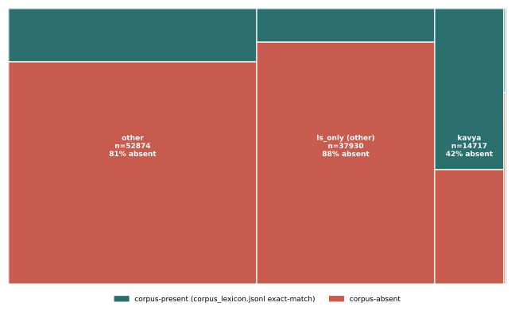

# H2856 E4 — ghost-headword census + absence model

_Created: 18-08-2026 · Last updated: 18-08-2026_

Computed by Sonnet 5 (`claude-sonnet-5`). Driver: [`src/h2856_e4_ghost_census.py`](https://github.com/gasyoun/SanskritLexicography/blob/master/RussianTranslation/src/h2856_e4_ghost_census.py). Re-run: `python src/h2856_e4_ghost_census.py` from `RussianTranslation/` (needs the gitignored `src/corpus_lexicon.jsonl` and `src/pwg.renou.jsonl` present locally).

## Inputs
- PWG headword set: `HeadwordLists/now-2026/PWG-unique-key1-106082.txt` — n=106082
- `src/corpus_lexicon.jsonl` — 1093391 aligned Sa-Ru rows, 191437 distinct `slp1` tokens
- `src/pwg.renou.jsonl` — per-key1 Renou state/provenance (`ls` vs `dcs`)
- `glossaries/epigraphic_vocabulary.md`, `jaina_vocabulary.md`, `kavya_lexicon.tsv` — register word lists

## Method note — two absence measures, reported honestly

Two different corpus-attestation signals are available and they disagree in a documented, non-trivial way:

- **Exact-match against `corpus_lexicon.jsonl`** (the memo's literal spec): a headword's `key1` must appear *verbatim* as some row's `slp1` field. `corpus_lexicon.jsonl` is a token-level aligned-translation corpus, not a lemmatiser output, so this under-counts presence for any headword that never happens to surface in its bare citation form.
- **`renou_dcs`-based** (from `pwg.renou.jsonl`, built from a separate, lemma-level DCS pass): a headword counts as present if *any* of its Renou states carries `dcs` provenance.

| measure | absent | n | absence rate |
|---|--:|--:|--:|
| exact-match `corpus_lexicon.jsonl` | 82487 | 106082 | 77.8% |
| `renou_dcs` (lemma-level) | 65066 | 106082 | 61.3% |

Concordance: 58178 headwords absent by **both** measures; 24309 absent by exact-match but present by `renou_dcs` (the expected direction — exact-match is the stricter, lossier test, as predicted above).

**The logistic model below uses the exact-match `corpus_lexicon.jsonl` measure as the dependent variable** — the memo's literal spec. Using `renou_dcs`-based absence as the dependent variable instead was tried and rejected: `ls_only` is *defined* (see below) as "has `ls` provenance and no `dcs` provenance", so against a `renou_dcs`-based outcome it is tautologically almost-perfectly predictive (fit degenerates: β≈23, OR in the billions, a construction artifact, not a finding). Against the independently-sourced `corpus_lexicon.jsonl` outcome, predictor and outcome come from different pipelines, so the fit below is a real estimate.

## `<ls>L.</ls>` marker — not found as specified; operationalised as `ls_only`

A literal search of the PWG source (`csl-orig/v02/pwg/pwg.txt`) for the exact string `<ls>L.</ls>` returns 0 hits; the 5 hits for `<ls>L. ...` are a manuscript siglum (`L. JĀT. ...`), unrelated. "L." is heavily overloaded in PWG's abbreviation table (Landessprache, Lebensstadium, Logik, Loblieder, Lärm — never "Lexicographen"). The actual "lexicographers-only" *signal* that exists in already-committed data is the `ls`/`dcs` **provenance** tag `renou_register.py` already computes per Renou state (`renou_glossary.py`'s own docstring: "ls = lexicographer cited it, dcs = corpus attestation"). This script defines `ls_only` = at least one state carries `ls` provenance and *no* state carries `dcs` — i.e. a headword whose only textual warrant is a citation from another lexicographer, never the corpus. n=42357 (39.9%).

## Register census

| register | n (of 106082 PWG headwords) |
|---|--:|
| epigraphic | 387 |
| jaina | 175 |
| kāvya | 14890 |
| ls_only (any) | 42357 |

## Logistic model — absence (corpus_lexicon.jsonl exact-match) ~ ls_only + register_epig + register_jaina + register_kavya

IRLS logistic regression (`numpy`, no external stats dependency — `statsmodels` is not installed in this environment); Wald 95% CI from the inverse-Fisher-information covariance.

| term | β | SE | odds ratio | 95% CI |
|---|--:|--:|--:|--:|
| intercept | 1.3378 | 0.0104 | 3.811 | [3.734, 3.889] |
| ls_only | 0.8594 | 0.0177 | 2.362 | [2.281, 2.445] |
| register_epig | 0.1144 | 0.1222 | 1.121 | [0.882, 1.425] |
| register_jaina | -0.4346 | 0.1755 | 0.647 | [0.459, 0.913] |
| register_kavya | -1.9478 | 0.0193 | 0.143 | [0.137, 0.148] |

**Headline: the `ls_only` (lexicographers-only-citation) odds ratio is 2.36 (95% CI [2.28, 2.45], n=106082).** A headword whose only citation is another lexicographer is 2.4x as likely to be corpus-absent as one with at least one primary-text citation.

## V3 — ghost-headword treemap by register

present/absent here is the exact-match `corpus_lexicon.jsonl` measure (same as the model above).

| bucket | present | absent | n | absence rate |
|---|--:|--:|--:|--:|
| other | 10202 | 42672 | 52874 | 80.7% |
| ls_only (other) | 4605 | 33325 | 37930 | 87.9% |
| kavya | 8600 | 6117 | 14717 | 41.6% |
| epig | 118 | 269 | 387 | 69.5% |
| jaina | 70 | 104 | 174 | 59.8% |

## Evidence
- Full census: [`research/h2856_ghost_headword_census.jsonl`](https://github.com/gasyoun/SanskritLexicography/blob/master/RussianTranslation/research/h2856_ghost_headword_census.jsonl) (106082 rows)
- Spot-check of 20 "absent" headwords: [`research/H2856_SPOT_CHECK.md`](https://github.com/gasyoun/SanskritLexicography/blob/master/RussianTranslation/research/H2856_SPOT_CHECK.md)

_Dr. Mārcis Gasūns_
