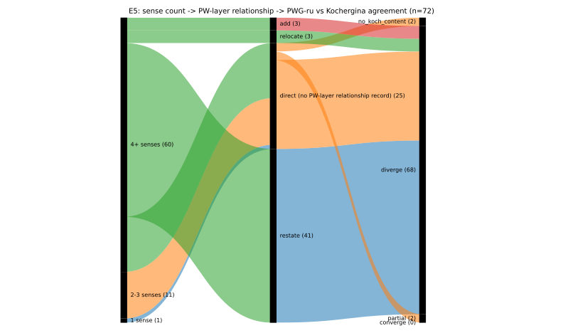

# H2856 E5 — three-way translation drift (de -> ru -> Kochergina)

_Created: 18-08-2026 · Last updated: 18-08-2026_

Computed by Sonnet 5 (`claude-sonnet-5`). Driver: [`src/h2856_e5_translation_drift.py`](https://github.com/gasyoun/SanskritLexicography/blob/master/RussianTranslation/src/h2856_e5_translation_drift.py). Re-run: `python src/h2856_e5_translation_drift.py` from `RussianTranslation/`.

## Inputs and join
- `src/pwg_ru_translated.jsonl`, layer=`pwg` — 143 distinct headwords
- `src/koch.jsonl` — 28369 distinct headwords (Kochergina 1987)
- `src/pwg_ru_relationships.jsonl` — PW<->PWG layer relationship records
- Matched (present in both PWG-ru and Kochergina): **n=72**

**Coverage caveat:** `pwg_ru_translated.jsonl` currently covers 254 distinct PWG headwords total (pwg_ru is an in-progress translation effort, not yet run over the full 106,082-headword PWG set — see [`pwg_ru.md`](https://github.com/gasyoun/SanskritLexicography/blob/master/RussianTranslation/pwg_ru.md)). E5's population is therefore bounded by pwg_ru's current progress, not by data availability for the full dictionary — the n=72 below will grow as pwg_ru does.

## Scope caveat — the relationship data is PW<->PWG, not de<->ru

The memo routes `pwg_ru_relationships.jsonl`'s restate/abridge typology as feeding "the sense-split axis" of E5. In the committed data this typology is actually recorded between the **PW and PWG dictionary layers** inside a pwg_ru card (multi-source card assembly — `layer: "pw"` rows being restated/added/relocated relative to the PWG base), not between the German skeleton and the Russian gloss directly. Used exactly as the memo names it, with this scope stated plainly rather than silently reframed as a de<->ru signal it is not.

## Sense-splitting (PWG-ru sense count vs Kochergina's single gloss)

| | n | share |
|---|--:|--:|
| split (PWG-ru has more distinguishable senses than 1) | 71 | 98.6% |
| merge (n_senses < 1, does not occur by construction) | 0 | 0.0% |
| drop (PWG-ru text <30% the length of Kochergina's) | 0 | 0.0% |

## PWG-ru <-> Kochergina disagreement

Disagreement = 1 - Jaccard(stemmed Russian content tokens). Mean disagreement across all 72 matched headwords: **0.978**.

| bucket | n | share |
|---|--:|--:|
| converge | 0 | 0.0% |
| partial | 2 | 2.8% |
| diverge | 68 | 94.4% |
| no_koch_content | 2 | 2.8% |

## Does a PW<->PWG relationship record correlate with more PWG-ru/Kochergina disagreement?

Mean disagreement for headwords **with** a relationship record: **0.987**; **without**: **0.959**.
Headwords with a PW<->PWG relationship record show **higher** PWG-ru/Kochergina disagreement than headwords without one — consistent with the memo's directional claim (more internal editorial complexity co-occurs with more external translation divergence).

Relationship-bucket distribution over the matched set:

| bucket | n |
|---|--:|
| restate | 41 |
| direct (no PW-layer relationship record) | 25 |
| relocate | 3 |
| add | 3 |

## V4 — translation-drift alluvial

sense count -> PW-layer relationship type -> PWG-ru/Kochergina agreement, ribbon width = share of the 72 matched headwords.

## Evidence
- Full per-headword table: [`research/h2856_translation_drift.jsonl`](https://github.com/gasyoun/SanskritLexicography/blob/master/RussianTranslation/research/h2856_translation_drift.jsonl) (72 rows)

_Dr. Mārcis Gasūns_
