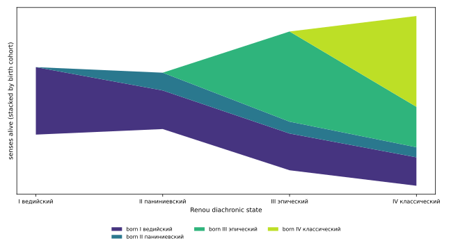

# H2856 V6 — sense-survival streamgraph

_Created: 18-08-2026 · Last updated: 18-08-2026_

Computed by Sonnet 5 (`claude-sonnet-5`). Driver: [`src/h2856_v6_survival_streamgraph.py`](https://github.com/gasyoun/SanskritLexicography/blob/master/RussianTranslation/src/h2856_v6_survival_streamgraph.py). Re-run: `python src/h2856_v6_survival_streamgraph.py` from `RussianTranslation/`.

## Input
`src/pwg_sense_stratum.jsonl` — 23461 headwords, 64296 senses total, 51268 senses with a dated Renou-state span (renou_oldest/renou_youngest both set). A load, not a derivation, per the memo's own note.

## Alive senses per state (stacked by birth cohort)

| state | total alive | citations | born I | born II | born III | born IV |
|---|--:|--:|--:|--:|--:|--:|
| I ведийский | 12988 | 207715 | 12988 | 0 | 0 | 0 |
| II паниниевский | 10852 | 216023 | 7427 | 3425 | 0 | 0 |
| III эпический | 26721 | 312157 | 7074 | 2282 | 17365 | 0 |
| IV классический | 32688 | 311830 | 5477 | 1937 | 7784 | 17490 |

## Finding: Renou state V is never populated in this artifact

`renou.py`'s canonical `STATES` tuple is `(I, II, III, IV, V)`, but a direct scan of `pwg_sense_stratum.jsonl` shows **0 of 64,296 senses** ever carry `renou_oldest` or `renou_youngest` == `"V"` — every span tops out at IV. This script therefore charts I-IV only; a 5th, always-empty "V" bar would misrepresent the data as having a state this artifact simply does not use. Recorded as a finding for [`SanskritLexicography/FINDINGS.md`](https://github.com/gasyoun/SanskritLexicography/blob/master/FINDINGS.md), not silently worked around.

## Headline

Of the senses first attested at state **I (Vedic)**, **42.2%** are still alive at state **IV (classical)** — total alive-sense count widens from I to IV (12988 <-> 32688).

## Evidence
- Full counts: [`research/h2856_sense_survival.json`](https://github.com/gasyoun/SanskritLexicography/blob/master/RussianTranslation/research/h2856_sense_survival.json)

_Dr. Mārcis Gasūns_
