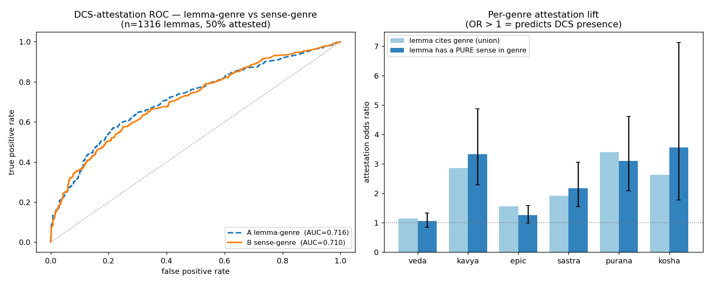

# E2 — sense-level genre vs DCS corpus attestation

_Created: 12-07-2026 · Last updated: 12-07-2026_

_Auto-generated by `research/analyze_sense_genre_attestation.py` (H350 backlog #3 / H833). Do not hand-edit metrics; re-run the script._

**Thesis (memo §E2).** A sense's genre profile, resolved from its own `<ls>` citations, predicts whether the lemma survives into the living DCS corpus better than the lemma's aggregate (smeared) genre does.

**Verdict: INCONCLUSIVE.** Sense-resolved genre (Model B) shows **no advantage** over the lemma-union representation (Model A): ΔAUC = -0.006 (95% bootstrap CI [-0.020, +0.009], straddling 0; the point estimate slightly favours the simpler lemma model). The memo's E2 thesis is **not supported** at this scale.

## Setup

- **Unit:** PWG→RU surface headword (store rows grouped by normalised IAST — *not* `key1`, which is the SLP1 root and would lump derived words), joined to DCS `dcs_freq_dims.json` `by_lemma` on NFC-normalised IAST.
- **n = 1316 lemmas** with a usable join key; **49.8% DCS-attested** (balanced target).
- **Genre** from `annotate_genres.genres_for_text` (H339) — per-sense `<ls>` → `ls_source_map.json` curated label → coarse bucket (veda, kavya, epic, sastra, purana, kosha).
- **No leakage:** PWG citations and DCS attestation are independent sources; the size baseline (n_senses, citation mass) absorbs the "richer lemmas are more attested" confound so genre is measured above it.

## Cross-validated AUC (5-fold stratified, out-of-fold)

| Model | Features | AUC |
|---|---|---:|
| 0 | size only (n_senses, citation mass) | 0.700 |
| A | 0 + lemma **union** coarse-genre (6) | 0.716 |
| B | 0 + **sense-resolution** genre (entropy, spread, pure-sense fracs) | 0.710 |
| A+B | 0 + both | 0.714 |

ΔAUC(B−A) = **-0.006**, 95% bootstrap CI [-0.020, +0.009]. The CI includes 0 — the sense-resolution edge is not established at this n; report as a non-result, not a win.

## Per-genre attestation lift

Odds ratio for DCS attestation. "union" = the lemma cites the genre anywhere; "pure sense" = the lemma has at least one sense cited *only* from that genre — a distinction invisible without sense resolution.

| Coarse genre | union OR | pure-sense OR (95% CI) | n(pure) |
|---|---:|---:|---:|
| veda | 1.14 | 1.06 [0.84, 1.32] | 456 |
| kavya | 2.86 | 3.33 [2.28, 4.87] | 153 |
| epic | 1.56 | 1.26 [0.99, 1.59] | 398 |
| sastra | 1.91 | 2.17 [1.54, 3.05] | 166 |
| purana | 3.39 | 3.10 [2.09, 4.61] | 136 |
| kosha | 2.63 | 3.55 [1.77, 7.13] | 45 |

## Interpretation

1. **Attestation is mostly about citation volume, not genre.** The size-only baseline already reaches AUC 0.700; adding genre (either granularity) lifts it only ~+0.016. How *much* PWG cites a word predicts DCS survival far better than *what kind* of source it cites.
2. **Genre still carries a real, interpretable signal** where it counts: a pure sense in kavya, sastra, purana, kosha significantly raises attestation odds (OR CI entirely above 1).
3. **Vedic-only senses do *not* predict DCS presence** (veda, epic: OR CI includes 1) — consistent with DCS's epic/classical corpus weighting: a purely-Vedic citation profile marks antiquarian vocabulary, not living-corpus survival.
4. **But sense-resolution buys nothing here.** The lemma union already encodes "cites kāvya / purāṇa / …"; splitting that to the sense level (entropy, pure-sense fractions) adds no separable predictive power over the aggregate at n=1316. The W4 "per-sense granularity is the right unit" thesis is *not* vindicated by corpus-attestation prediction — though it may still matter for other targets (per-sense WSD in E3, the entry portrait in V7). Re-run as the store grows past the current 219 verb-root families.



## Reproduce

```sh
cd RussianTranslation/research
python analyze_sense_genre_attestation.py   # reads ../src store + dcs_freq_dims
```

Inputs `pwg_ru_translated.jsonl` and `dcs_freq_dims.json` are gitignored (local store); the script, JSON metrics, and figure are committed.

_Dr. Mārcis Gasūns_
