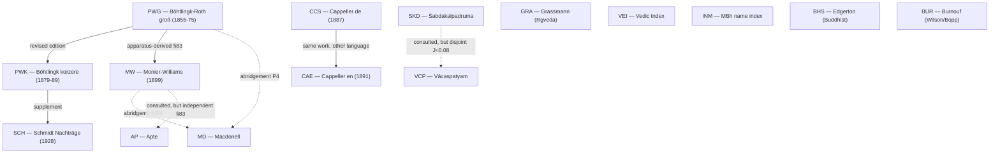

# Dictionary witness-independence map & re-audit of the 15-dict union corroboration

_Created: 20-07-2026 · Last updated: 20-07-2026_

**What this is.** The published cross-dict union
([UNION.md](https://github.com/gasyoun/SanskritLexicography/blob/master/HeadwordLists/union/UNION.md),
[union_headwords.tsv](https://github.com/gasyoun/SanskritLexicography/blob/master/HeadwordLists/union/union_headwords.tsv))
records, for each of 323,425 headwords, **how many of 15 dictionaries attest
it** — and publishes that "in N dicts" distribution. In practice that count is
read as **corroboration**: a headword "in 15 dicts" looks fifteen-times
confirmed. This document builds the **witness-independence map** — which of the
15 dictionaries are genuinely independent witnesses of a headword's attestation
and which are the same work, revised editions, supplements, or headword-inventory
derivatives of one another — and **re-audits the corroboration distribution
under it**. Handoff:
[H1363](https://github.com/gasyoun/Uprava/blob/main/handoffs/H1363-Opus_SanskritLexicography_dictionary-witness-independence-map-and-union-corroboration-reaudit_20.07.26.md).
Computed 20-07-2026 by Opus 4.8 (`claude-opus-4-8`).

**The claim being audited.** "Attested in N dictionaries" is not "confirmed by N
independent sources." Corroboration requires **independence**: two witnesses that
copied their headword list from a common ancestor confirm the ancestor once, not
twice. Several of the 15 dictionaries fail that test — some flagrantly (CAE and
CCS are literally one dictionary printed in two languages).

**This does not start from zero — it operationalizes a standing ruling.**
[FINDINGS §83](https://github.com/gasyoun/SanskritLexicography/blob/master/FINDINGS.md)
already ruled, measured six ways in
[csl-atlas A10](https://github.com/sanskrit-lexicon/csl-atlas/blob/main/docs/articles/article_21_apparatus_not_errors.md),
that **"PWG, PW and MW collapse to roughly one European witness"** — MW inherited
Böhtlingk's *apparatus* (which words to enter, which texts to cite, in what
order), so MW↔Petersburg agreement is *inheritance, not independent
confirmation*. [FINDINGS §97](https://github.com/gasyoun/SanskritLexicography/blob/master/FINDINGS.md)
gives the bibliographic reason (MW was compiled substantially *from*
Böhtlingk-Roth) and states the reusable rule: **when measuring whether a word is
attested elsewhere, first exclude every dictionary derived from the source.** The
gap is that the published union "in ≥2 dicts" counts still treat all 15 as
independent. This document supplies the missing step: it *quantifies* what the
§83/§97 ruling does to those counts.

Two load-bearing constraints §83 places on the map, honored below:
- **Apte is the named independent European control**, not a derivative: its
  sensitivity to PWG's inclusion decisions is 1.5× (an independent compiler's
  baseline) against MW's 12.3×, and it independently supplies 54.6% of the
  indigenous words PWG omits — *more* than MW. So AP is **never folded**.
- The non-independence is of **scholarship/inventory, not typesetting**: MW
  carries none of Böhtlingk's mechanical errors and recomposed its English prose.
  So this re-audit deflates **attestation** corroboration (does the word exist),
  which is exactly what a headword-membership count measures.

## The 15 dictionaries

| Code | Dictionary | Lang | Kind |
|---|---|---|---|
| **AP** | Apte, *Practical Sanskrit-English Dictionary* (rev.) | Sa→En | critical, school-scale |
| **BHS** | Edgerton, *Buddhist Hybrid Sanskrit Dictionary* | Sa→En | corpus lexicon (Buddhist) |
| **BUR** | Burnouf, *Dictionnaire classique sanscrit-français* | Sa→Fr | critical (Wilson/Bopp line) |
| **CAE** | Cappeller, *Sanskrit-English Dictionary* | Sa→En | critical |
| **CCS** | Cappeller, *Sanskrit-Wörterbuch* (companion to CAE) | Sa→De | critical |
| **GRA** | Grassmann, *Wörterbuch zum Rig-Veda* | Sa→De | text concordance (Ṛgveda) |
| **INM** | Sörensen, *Index to the Names in the Mahābhārata* | Sa→En | text name-index (MBh) |
| **MD** | Macdonell, *Sanskrit-English Dictionary* | Sa→En | critical, school-scale |
| **MW** | Monier-Williams, *A Sanskrit-English Dictionary* (1899) | Sa→En | critical, comprehensive |
| **PWG** | Böhtlingk & Roth, *Sanskrit-Wörterbuch* (groß) | Sa→De | critical, foundational |
| **PWK** | Böhtlingk, *…in kürzerer Fassung* | Sa→De | revised condensation of PWG |
| **SCH** | Schmidt, *Nachträge zum Sanskrit-Wörterbuch* | Sa→De | supplement to PWK |
| **SKD** | Rādhākānta Deva, *Śabdakalpadruma* | Sa→Sa | indigenous kośa |
| **VCP** | Tārānātha, *Vācaspatyam* | Sa→Sa | indigenous kośa |
| **VEI** | Macdonell & Keith, *Vedic Index of Names and Subjects* | Sa→En | text subject-index (Vedic) |

## The witness-independence map — derivation graph

Edges point from ancestor to derivative and are typed by how strongly the
derivative's **headword inventory** depends on its ancestor (the gloss prose can
be independent even where the headword list is not — that distinction is the
crux of the MW edge below).

Solid edges = collapse-worthy dependence (the derivative is not an independent
witness; collapsed by P3). Dashed edges = a *consulted* source that nonetheless
stays an independent witness — either measured independent (AP per §83; VCP by
overlap) or collapsed only in the strict P4 rung (MD).

**Edge grounding.**

| Edge | Type | Evidence |
|---|---|---|
| CCS → CAE | **same work** | Cappeller's German (1887) and English (1891) editions of *one* dictionary; CAE–CCS Jaccard **0.672**, the single highest pair in the [overlap matrix](https://github.com/gasyoun/SanskritLexicography/blob/master/data/HEADWORD_OVERLAP_UNION15_2026.md). Two editions, one witness. |
| PWG → PWK | **revised edition** | PWK is Böhtlingk's own revised condensation of Böhtlingk-Roth ([DICTIONARY_CHAIN.md](https://github.com/gasyoun/SanskritLexicography/blob/master/RussianTranslation/DICTIONARY_CHAIN.md)); shared editor, shared source-reading tradition. Jaccard **0.630**. |
| PWK → SCH | **supplement** | Schmidt 1928 is pure *Nachträge* (addenda) to PWK, keyed to its sense numbers ([DICTIONARY_CHAIN.md](https://github.com/gasyoun/SanskritLexicography/blob/master/RussianTranslation/DICTIONARY_CHAIN.md)). Not an independent inventory — an extension of one. |
| PWG → MW | **apparatus-derived** | The load-bearing edge, and **already ruled**: [FINDINGS §83](https://github.com/gasyoun/SanskritLexicography/blob/master/FINDINGS.md) — MW inherited Böhtlingk's apparatus; whether MW enters a word is **12.3×** more predicted by PWG's decision than an independent compiler's (vs Apte 1.5×). [§97](https://github.com/gasyoun/SanskritLexicography/blob/master/FINDINGS.md): MW compiled substantially *from* Böhtlingk-Roth. [§28](https://github.com/gasyoun/SanskritLexicography/blob/master/FINDINGS.md): 0.81 citation-order concordance. MW's *glosses* are independent English; its *headword inventory* is Petersburg-derived. |
| MW ⇢ AP | **consulted, NOT collapsed** | Apte consulted MW/Böhtlingk **but is §83's named independent control** — gap-sensitivity 1.5× (independent-compiler baseline), ~40% unique headwords, and supplies 54.6% of PWG-omitted indigenous words (more than MW). Never folded. |
| PWG/MW ⇢ MD | **abridgement (P4 only)** | Macdonell's *Practical Dictionary* is a school abridgment of MW/Böhtlingk (2.0% unique headwords) — folded into Petersburg only in the strict P4 rung. |
| SKD ⇢ VCP | **consulted, disjoint** | Both Bengal indigenous kośas; Vācaspatyam consulted Śabdakalpadruma — **but** SKD–VCP Jaccard is only **≈0.084**, so at the headword level they attest largely disjoint inventories. §83's independent non-European anchor; kept separate. |

**Independent by construction (no collapse at any policy).** GRA (Ṛgveda),
VEI (Vedic index), INM (Mahābhārata name index) are **text concordances** — each
attests that a word occurs in a specific primary corpus, the strongest kind of
independent witness. BHS (Edgerton's Buddhist corpus) and BUR (Burnouf, on the
Wilson/Bopp line, not Petersburg) are independent traditions. §97 explicitly
names AP, GRA, BHS as the genuinely independent evidence.

## Collapse policies — the independence ladder

Two dictionaries sharing a cluster count as **one** independent witness of any
headword they both attest. The ladder runs from the published identity map (P0)
to the §83/§97 ruling (P3) and one strict step beyond (P4). Machine map:
[witness_independence_clusters.tsv](https://github.com/gasyoun/SanskritLexicography/blob/master/data/witness_independence_clusters.tsv).

| Policy | Clusters | Collapse added | Strength |
|---|--:|---|---|
| **P0** published | 15 | — (identity; each dict its own witness) | baseline (the count now published) |
| **P1** same-work | 14 | {CAE, CCS} | **indisputable** (one book, two languages) |
| **P2** editorial-lineage | 12 | + {PWG, PWK, SCH} = Petersburg | **documented** (revised edition + supplement) |
| **P3** §83/§97 ruling | 11 | + MW into Petersburg | **the established finding** |
| **P4** strict | 10 | + MD (school abridgment) into Petersburg | **defensible** (AP deliberately kept out) |

**P3 is the substantive answer** — it is FINDINGS §83's "PWG, PW and MW collapse
to roughly one European witness" applied to the published counts, which is
exactly what this re-audit was asked to produce. P1/P2 are intermediate (they
under-collapse by leaving MW out); P4 is one honest step further (Macdonell's
abridgment). Apte is **not** on this ladder at any rung — §83 measured it
independent, so folding it would contradict the repo's own finding.

## Re-audited corroboration — headline

The number of headwords the published count calls **corroborated** (attested in
≥2 witnesses) versus what survives once non-independent witnesses are merged:

| Policy | Single-witness (n=1) | Corroborated (n≥2) | Corroborated share | Newly single vs P0 |
|---|--:|--:|--:|--:|
| **P0** published | 142,621 | 180,804 | **55.9%** | — |
| **P1** same-work | 142,985 | 180,440 | 55.8% | +364 |
| **P2** editorial-lineage | 151,555 | 171,870 | 53.1% | +8,934 |
| **P3** §83/§97 ruling | 211,272 | 112,153 | **34.7%** | +68,651 |
| **P4** strict (+MD) | 214,556 | 108,869 | 33.7% | +71,935 |

**The finding.** The "same work in two languages" collapse (CAE≡CCS) alone
reclassifies 364 headwords from corroborated to single-witness. Collapsing the
documented Petersburg editorial lineage (P2) reclassifies **8,934**. Under the
**established §83/§97 ruling** (P3) — MW folded into the Petersburg witness —
**68,651** headwords that the published table presents as multiply-attested rest
on a **single European lineage**, and the corroborated share collapses from
55.9% to **34.7%**. More than a third of the union's apparent corroboration is
lineage-internal inheritance, not independent confirmation. This is driven by
MW's size (193,852 headwords) and its heavy overlap with the Petersburg dicts
(MW∩PWG 94,753; MW∩PWK 128,971). Folding Macdonell's abridgment too (P4) costs
another 3,284 headwords their corroboration; Apte, left independent per §83,
holds the share at 33.7% rather than the ~29% an AP fold would force.

**The "well-corroborated" tier shrinks even faster.** Headwords attested by ≥5
witnesses — a natural "solidly attested" threshold:

| Policy | ≥5 witnesses | share |
|---|--:|--:|
| P0 published | 43,825 | 13.6% |
| P2 editorial-lineage | 21,393 | 6.6% |
| P3 §83/§97 ruling | 12,135 | 3.8% |
| P4 strict (+MD) | 8,797 | 2.7% |

The ≥5-witness set more than halves under the documented collapse and shrinks to
**28%** of its published size under the established ruling (P3).

## The second inflation channel — MW's L.-only listings

Folding MW into the Petersburg witness (P3) is one deflation. There is a second,
partly *inside* MW, that the union cannot fully resolve but can bound.
[§97 v2](https://github.com/gasyoun/SanskritLexicography/blob/master/FINDINGS.md)
found that MW's own `<ls>L.</ls>` ("lexicographers") marker flags **59,697 of
MW's 194,084 headwords (30.8%)** as koṣa-sourced with *no text citation* — MW is
merely *listing* the word from another dictionary, not independently attesting it
from a text.

Locate this in the corroboration counts: MW is a witness for **193,852** union
headwords. Of these, **59,717** have their *entire* corroboration in MW + the
Petersburg family — they are exactly the headwords that drop from ≥2 to a single
witness when MW folds in (the P2→P3 newly-single set). Applying §97's aggregate
30.8% rate, **≈18,368** of those 59,717 rest on MW *listing* a Petersburg/koṣa
word rather than attesting it — corroboration that is neither independent (it is
Petersburg-internal) nor even text-grounded (it is a lexicographer's cross-copy).

This is an **upper-bound estimate**, not a per-headword resolution: the union
carries headword membership, not citation type, so the exact L.-only subset needs
csl-orig `<ls>L.</ls>` parsing (deliberately out of scope here — flagged as the
strongest available next step). The direction is unambiguous: text-attestation
corroboration is **lower** than even the P3 figure.

## Full re-audited distributions

Headwords by number of **distinct independent witnesses** under each policy
(machine form:
[witness_independence_reaudit.tsv](https://github.com/gasyoun/SanskritLexicography/blob/master/data/witness_independence_reaudit.tsv)):

| n witnesses | P0 (15) | P1 (14) | P2 (12) | P3 (11) | P4 (10) |
|--:|--:|--:|--:|--:|--:|
| 1 | 142,621 | 142,985 | 151,555 | 211,272 | 214,556 |
| 2 | 61,449 | 61,712 | 91,824 | 66,077 | 66,365 |
| 3 | 46,787 | 48,647 | 38,424 | 23,175 | 23,120 |
| 4 | 28,743 | 30,826 | 20,229 | 10,766 | 10,587 |
| 5 | 17,234 | 17,881 | 9,724 | 5,630 | 5,198 |
| 6 | 10,305 | 9,202 | 5,335 | 3,425 | 2,142 |
| 7 | 5,848 | 5,114 | 3,313 | 1,748 | 991 |
| 8 | 3,930 | 3,287 | 1,726 | 887 | 359 |
| 9 | 2,928 | 2,025 | 860 | 341 | 91 |
| 10 | 1,876 | 990 | 332 | 88 | 16 |
| 11 | 967 | 506 | 87 | 16 | — |
| 12 | 493 | 193 | 16 | — | — |
| 13 | 188 | 46 | — | — | — |
| 14 | 45 | 11 | — | — | — |
| 15 | 11 | — | — | — | — |

The 11 headwords "in all 15 dictionaries" — the maximally-corroborated tier —
have **at most 12 independent witnesses** (P2), 11 (P3), 10 (P4): even the
most-attested Sanskrit vocables lose witnesses to lineage-collapse. Note the P2
n=2 spike (91,824): collapsing three Petersburg dicts into one pushes a large
mass of "in 3–4 dicts, mostly Petersburg" headwords down to exactly two
independent witnesses. Under P3, 211,272 headwords (65.3%) rest on a single
witness — up from the published 44.1%.

## Documented data drift — UNION.md table is pre-fold

Reproducing the published "in N dicts" distribution surfaced a discrepancy worth
recording. **UNION.md's table sums to 323,662** (142,673 singletons + 180,989 in
≥2), but the current canonical
[union_headwords.tsv](https://github.com/gasyoun/SanskritLexicography/blob/master/HeadwordLists/union/union_headwords.tsv)
holds **323,425** rows. The published table was computed on the **pre-fold**
union; the live file is **post-fold** — 237 gender-confirmed `-inī` feminines
have since been folded onto their `-in` base (per UNION.md's own method note).
Total per-bucket drift is exactly **237 headwords**, all attributable to that
fold. The re-audit here runs on the live post-fold file; its P0 identity map
reproduces the live file's own `n_dicts` column exactly (the built-in regression
anchor, `--check`). UNION.md's headline table should be regenerated on the
post-fold file to close the drift.

## Method & reproduction

- Script:
  [witness_independence_reaudit.py](https://github.com/gasyoun/SanskritLexicography/blob/master/data/witness_independence_reaudit.py)
  — consumes `union_headwords.tsv` as-is (never rebuilt), applies each policy's
  cluster map, counts distinct clusters per headword. `--check` asserts P0 ==
  the file's `n_dicts` histogram. The machine-readable map (per-edge ruling +
  family partition + L.-tier estimate) is
  [witness_tiers.json](https://github.com/gasyoun/SanskritLexicography/blob/master/data/witness_tiers.json).
- The independence map is a **headword-attestation** model: it asks whether two
  dictionaries independently attest that a *word exists*, not whether their
  *glosses* agree. A dictionary can inherit a headword list while writing
  original definitions (MW is exactly this case, per §83) — so these numbers
  deflate **attestation** corroboration, and a separate gloss-agreement study
  would deflate **semantic** corroboration differently.
- The ladder is deliberately transparent, anchored on the established ruling:
  P1 indisputable, P2 documented, **P3 = the §83/§97 finding (the substantive
  answer)**, P4 one strict step further. Report the range; the honest centre is
  P3.
- **A stronger re-audit is available and not done here.** [§97
  v2](https://github.com/gasyoun/SanskritLexicography/blob/master/FINDINGS.md)
  found MW's own `<ls>L.</ls>` ("lexicographers") marker flags **30.8%** of MW
  headwords as koṣa-sourced with *no text citation* — so bare MW membership
  overstates even text-attestation within MW. This union file carries only
  headword membership, not per-entry citation type, so that finer cut can't be
  applied here; a re-audit reading MW's non-`L.` `<ls>` from csl-orig would
  deflate the counts further still. Exact-SLP1 membership is also a **lower
  bound** (variant spelling/accent misses a real shared headword).

## FAIR / provenance

Extends dataset **E40** (the
[15-dict overlap matrix](https://github.com/gasyoun/SanskritLexicography/blob/master/data/HEADWORD_OVERLAP_UNION15_2026.md),
[FAIR Release #1](https://github.com/gasyoun/SanskritLexicography/blob/master/data/FAIR_RELEASE_1.md))
with an independence-corrected corroboration layer. Same CC-BY-4.0 terms; the
output TSVs + JSON are derived-from `union_headwords.tsv` and carry no new source
text.

## Decisions taken (H1363 autonomy contract)

- **Artifact location: `data/`, not `HeadwordLists/`.** The handoff named
  `HeadwordLists/WITNESS_INDEPENDENCE.md` + `HeadwordLists/witness_tiers.json`.
  Placed instead in `data/` beside the sibling it directly extends
  ([HEADWORD_OVERLAP_UNION15_2026.md](HEADWORD_OVERLAP_UNION15_2026.md), the
  overlap matrix over the same union) and the other derived cross-dict datasets,
  with a self-identifying filename per the org naming rule. The machine-readable
  `witness_tiers.json` is delivered as specified.
- **Recompute consumes the union directly**, not `headword_overlap_matrix.tsv`.
  The union (`union_headwords.tsv`) is the source the overlap matrix is itself
  derived from and carries the full per-headword dict list — so computing
  distinct-family counts per headword from it is exact and reuse-clean; the
  pairwise matrix is a lossy projection for this purpose.
- **Family map follows §83 literally:** Apte is not a Petersburg member (the
  named independent control); MW folds at P3, MD at P4.

_Dr. Mārcis Gasūns_
