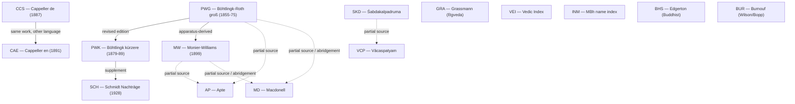

# Dictionary witness-independence map & re-audit of the 15-dict union corroboration

_Created: 20-07-2026 · Last updated: 20-07-2026_

**What this is.** The published cross-dict union
([UNION.md](https://github.com/gasyoun/SanskritLexicography/blob/master/HeadwordLists/union/UNION.md),
[union_headwords.tsv](https://github.com/gasyoun/SanskritLexicography/blob/master/HeadwordLists/union/union_headwords.tsv))
records, for each of 323,425 headwords, **how many of 15 dictionaries attest
it** — and publishes that "in N dicts" distribution. In practice that count is
read as **corroboration**: a headword "in 15 dicts" looks fifteen-times
confirmed. This document builds the **witness-independence map** — which of the
15 dictionaries are genuinely independent witnesses of a headword's attestation
and which are the same work, revised editions, supplements, or headword-inventory
derivatives of one another — and **re-audits the corroboration distribution
under it**. Handoff:
[H1363](https://github.com/gasyoun/Uprava/blob/main/handoffs/H1363-Opus_SanskritLexicography_dictionary-witness-independence-map-and-union-corroboration-reaudit_20.07.26.md).
Computed 20-07-2026 by Opus 4.8 (`claude-opus-4-8`).

**The claim being audited.** "Attested in N dictionaries" is not "confirmed by N
independent sources." Corroboration requires **independence**: two witnesses that
copied their headword list from a common ancestor confirm the ancestor once, not
twice. Several of the 15 dictionaries fail that test — some flagrantly (CAE and
CCS are literally one dictionary printed in two languages).

## The 15 dictionaries

| Code | Dictionary | Lang | Kind |
|---|---|---|---|
| **AP** | Apte, *Practical Sanskrit-English Dictionary* (rev.) | Sa→En | critical, school-scale |
| **BHS** | Edgerton, *Buddhist Hybrid Sanskrit Dictionary* | Sa→En | corpus lexicon (Buddhist) |
| **BUR** | Burnouf, *Dictionnaire classique sanscrit-français* | Sa→Fr | critical (Wilson/Bopp line) |
| **CAE** | Cappeller, *Sanskrit-English Dictionary* | Sa→En | critical |
| **CCS** | Cappeller, *Sanskrit-Wörterbuch* (companion to CAE) | Sa→De | critical |
| **GRA** | Grassmann, *Wörterbuch zum Rig-Veda* | Sa→De | text concordance (Ṛgveda) |
| **INM** | Sörensen, *Index to the Names in the Mahābhārata* | Sa→En | text name-index (MBh) |
| **MD** | Macdonell, *Sanskrit-English Dictionary* | Sa→En | critical, school-scale |
| **MW** | Monier-Williams, *A Sanskrit-English Dictionary* (1899) | Sa→En | critical, comprehensive |
| **PWG** | Böhtlingk & Roth, *Sanskrit-Wörterbuch* (groß) | Sa→De | critical, foundational |
| **PWK** | Böhtlingk, *…in kürzerer Fassung* | Sa→De | revised condensation of PWG |
| **SCH** | Schmidt, *Nachträge zum Sanskrit-Wörterbuch* | Sa→De | supplement to PWK |
| **SKD** | Rādhākānta Deva, *Śabdakalpadruma* | Sa→Sa | indigenous kośa |
| **VCP** | Tārānātha, *Vācaspatyam* | Sa→Sa | indigenous kośa |
| **VEI** | Macdonell & Keith, *Vedic Index of Names and Subjects* | Sa→En | text subject-index (Vedic) |

## The witness-independence map — derivation graph

Edges point from ancestor to derivative and are typed by how strongly the
derivative's **headword inventory** depends on its ancestor (the gloss prose can
be independent even where the headword list is not — that distinction is the
crux of the MW edge below).

Solid edges = collapse-worthy dependence (the derivative is not an independent
witness). Dashed edges = partial dependence (the derivative added substantial
independent material; collapsed only in the aggressive upper-bound policy).

**Edge grounding.**

| Edge | Type | Evidence |
|---|---|---|
| CCS → CAE | **same work** | Cappeller's German (1887) and English (1891) editions of *one* dictionary; CAE–CCS Jaccard **0.672**, the single highest pair in the [overlap matrix](https://github.com/gasyoun/SanskritLexicography/blob/master/data/HEADWORD_OVERLAP_UNION15_2026.md). Two editions, one witness. |
| PWG → PWK | **revised edition** | PWK is Böhtlingk's own revised condensation of Böhtlingk-Roth ([DICTIONARY_CHAIN.md](https://github.com/gasyoun/SanskritLexicography/blob/master/RussianTranslation/DICTIONARY_CHAIN.md)); shared editor, shared source-reading tradition. Jaccard **0.630**. |
| PWK → SCH | **supplement** | Schmidt 1928 is pure *Nachträge* (addenda) to PWK, keyed to its sense numbers ([DICTIONARY_CHAIN.md](https://github.com/gasyoun/SanskritLexicography/blob/master/RussianTranslation/DICTIONARY_CHAIN.md)). Not an independent inventory — an extension of one. |
| PWG → MW | **apparatus-derived** | MW inherited the Petersburg citation apparatus/skeleton — [FINDINGS §28](https://github.com/gasyoun/SanskritLexicography/blob/master/FINDINGS.md): 0.81 citation-order concordance, "structural inheritance of the apparatus, independent authorship of the glosses." MW's *glosses* are independent English; its *headword inventory* is largely Petersburg-derived. |
| PWG/MW ⇢ AP, MD | **partial source** | Apte and Macdonell drew their headword inventory from Böhtlingk/MW plus independent indigenous material. AP still keeps ~40% unique headwords (see below), so this is a partial, not total, dependence. |
| SKD ⇢ VCP | **partial source** | Both Bengal indigenous kośas; Vācaspatyam post-dates and consulted Śabdakalpadruma — **but** SKD–VCP Jaccard is only **≈0.084**, so at the headword level they attest largely disjoint inventories. Kept independent on the data. |

**Independent by construction (no collapse at any policy).** GRA (Ṛgveda),
VEI (Vedic index), INM (Mahābhārata name index) are **text concordances** — each
attests that a word occurs in a specific primary corpus, the strongest kind of
independent witness. BHS (Edgerton's Buddhist corpus) and BUR (Burnouf, on the
Wilson/Bopp line, not Petersburg) are independent traditions.

## Collapse policies — the independence ladder

Two dictionaries sharing a cluster count as **one** independent witness of any
headword they both attest. The ladder runs from the published identity map to an
aggressive upper bound; each rung is labelled by the evidentiary strength of the
collapse it adds. Machine map:
[witness_independence_clusters.tsv](https://github.com/gasyoun/SanskritLexicography/blob/master/data/witness_independence_clusters.tsv).

| Policy | Clusters | Collapse added | Strength |
|---|--:|---|---|
| **P0** published | 15 | — (identity; each dict its own witness) | baseline |
| **P1** same-work | 14 | {CAE, CCS} | **indisputable** |
| **P2** editorial-lineage | 12 | + {PWG, PWK, SCH} = Petersburg | **documented** |
| **P3** apparatus-genealogy | 11 | + MW into Petersburg | **defensible** |
| **P4** aggressive | 9 | + {AP, MD} into the Western lineage | **upper bound** (over-collapses) |

P4 is reported as an outer bound only: AP retains ~40% unique headwords, so
folding it fully into the Petersburg lineage overstates the dependence. The
honest reading of the evidence sits at **P2 (documented) to P3 (defensible)**.

## Re-audited corroboration — headline

The number of headwords the published count calls **corroborated** (attested in
≥2 witnesses) versus what survives once non-independent witnesses are merged:

| Policy | Single-witness (n=1) | Corroborated (n≥2) | Corroborated share | Newly single vs P0 |
|---|--:|--:|--:|--:|
| **P0** published | 142,621 | 180,804 | **55.9%** | — |
| **P1** same-work | 142,985 | 180,440 | 55.8% | +364 |
| **P2** editorial-lineage | 151,555 | 171,870 | 53.1% | +8,934 |
| **P3** apparatus-genealogy | 211,272 | 112,153 | **34.7%** | +68,651 |
| **P4** aggressive | 228,683 | 94,742 | 29.3% | +86,062 |

**The finding.** The "same work in two languages" collapse (CAE≡CCS) alone
reclassifies 364 headwords from corroborated to single-witness. Collapsing the
documented Petersburg editorial lineage (P2) reclassifies **8,934**. Once MW —
whose headword apparatus is Petersburg-derived (P3) — is folded in, **68,651**
headwords that the published table presents as multiply-attested rest on a
**single Petersburg lineage**, and the corroborated share collapses from 55.9%
to **34.7%**. More than a third of the union's apparent corroboration is
lineage-internal, not independent confirmation. This is driven by MW's size
(193,852 headwords) and its heavy overlap with the Petersburg dicts
(MW∩PWG 94,753; MW∩PWK 128,971).

**The "well-corroborated" tier shrinks even faster.** Headwords attested by ≥5
witnesses — a natural "solidly attested" threshold:

| Policy | ≥5 witnesses | share |
|---|--:|--:|
| P0 published | 43,825 | 13.6% |
| P2 editorial-lineage | 21,393 | 6.6% |
| P3 apparatus-genealogy | 12,135 | 3.8% |

The ≥5-witness set more than halves under the documented collapse and shrinks to
**28%** of its published size under the defensible one.

## Full re-audited distributions

Headwords by number of **distinct independent witnesses** under each policy
(machine form:
[witness_independence_reaudit.tsv](https://github.com/gasyoun/SanskritLexicography/blob/master/data/witness_independence_reaudit.tsv)):

| n witnesses | P0 (15) | P1 (14) | P2 (12) | P3 (11) | P4 (9) |
|--:|--:|--:|--:|--:|--:|
| 1 | 142,621 | 142,985 | 151,555 | 211,272 | 228,683 |
| 2 | 61,449 | 61,712 | 91,824 | 66,077 | 63,366 |
| 3 | 46,787 | 48,647 | 38,424 | 23,175 | 19,223 |
| 4 | 28,743 | 30,826 | 20,229 | 10,766 | 7,308 |
| 5 | 17,234 | 17,881 | 9,724 | 5,630 | 2,828 |
| 6 | 10,305 | 9,202 | 5,335 | 3,425 | 1,325 |
| 7 | 5,848 | 5,114 | 3,313 | 1,748 | 506 |
| 8 | 3,930 | 3,287 | 1,726 | 887 | 160 |
| 9 | 2,928 | 2,025 | 860 | 341 | 26 |
| 10 | 1,876 | 990 | 332 | 88 | — |
| 11 | 967 | 506 | 87 | 16 | — |
| 12 | 493 | 193 | 16 | — | — |
| 13 | 188 | 46 | — | — | — |
| 14 | 45 | 11 | — | — | — |
| 15 | 11 | — | — | — | — |

The 11 headwords "in all 15 dictionaries" — the maximally-corroborated tier —
have **at most 12 independent witnesses** (P2), 11 (P3): even the most-attested
Sanskrit vocables lose a witness or two to lineage-collapse. Note the P2 n=2
spike (91,824): collapsing three Petersburg dicts into one pushes a large mass of
"in 3–4 dicts, mostly Petersburg" headwords down to exactly two independent
witnesses.

## Documented data drift — UNION.md table is pre-fold

Reproducing the published "in N dicts" distribution surfaced a discrepancy worth
recording. **UNION.md's table sums to 323,662** (142,673 singletons + 180,989 in
≥2), but the current canonical
[union_headwords.tsv](https://github.com/gasyoun/SanskritLexicography/blob/master/HeadwordLists/union/union_headwords.tsv)
holds **323,425** rows. The published table was computed on the **pre-fold**
union; the live file is **post-fold** — 237 gender-confirmed `-inī` feminines
have since been folded onto their `-in` base (per UNION.md's own method note).
Total per-bucket drift is exactly **237 headwords**, all attributable to that
fold. The re-audit here runs on the live post-fold file; its P0 identity map
reproduces the live file's own `n_dicts` column exactly (the built-in regression
anchor, `--check`). UNION.md's headline table should be regenerated on the
post-fold file to close the drift.

## Method & reproduction

- Script:
  [witness_independence_reaudit.py](https://github.com/gasyoun/SanskritLexicography/blob/master/data/witness_independence_reaudit.py)
  — consumes `union_headwords.tsv` as-is (never rebuilt), applies each policy's
  cluster map, counts distinct clusters per headword. `--check` asserts P0 ==
  the file's `n_dicts` histogram.
- The independence map is a **headword-attestation** model: it asks whether two
  dictionaries independently attest that a *word exists*, not whether their
  *glosses* agree. A dictionary can inherit a headword list while writing
  original definitions (MW is exactly this case) — so these numbers deflate
  **attestation** corroboration, and a separate gloss-agreement study would
  deflate **semantic** corroboration differently.
- The ladder is deliberately transparent rather than committing to one collapse:
  P1 is indisputable, P2 documented, P3 defensible, P4 an upper bound. Report
  the range, not a single number.

## FAIR / provenance

Extends dataset **E40** (the
[15-dict overlap matrix](https://github.com/gasyoun/SanskritLexicography/blob/master/data/HEADWORD_OVERLAP_UNION15_2026.md),
[FAIR Release #1](https://github.com/gasyoun/SanskritLexicography/blob/master/data/FAIR_RELEASE_1.md))
with an independence-corrected corroboration layer. Same CC-BY-4.0 terms; the two
output TSVs are derived-from `union_headwords.tsv` and carry no new source text.

_Dr. Mārcis Gasūns_
